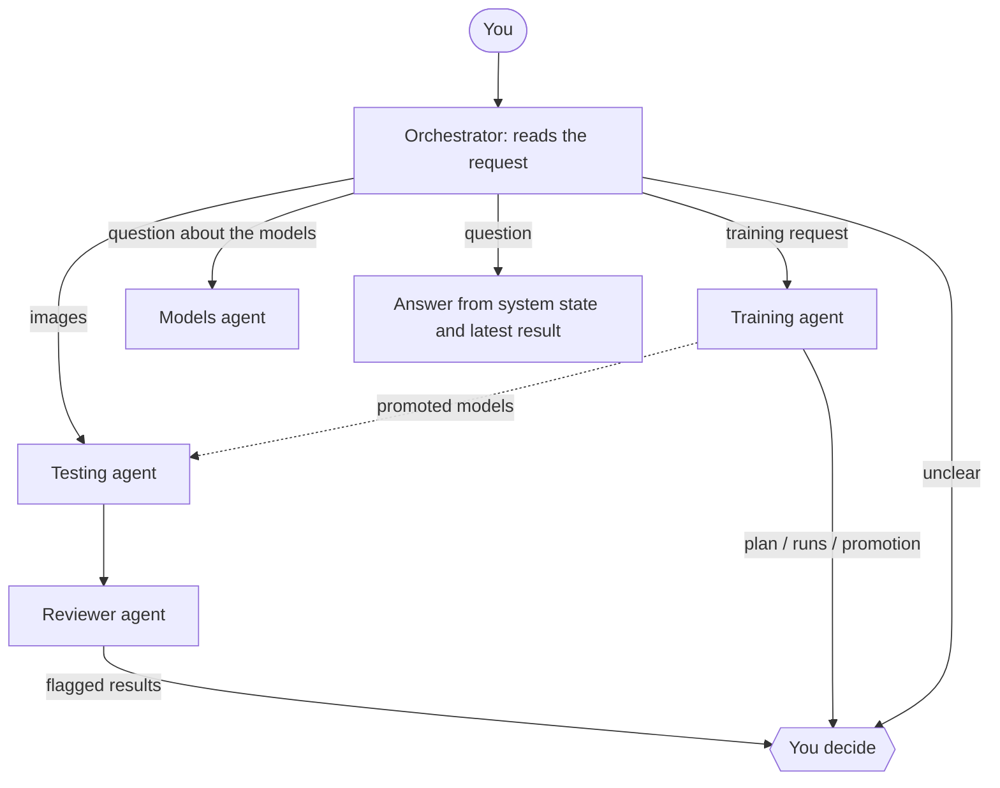
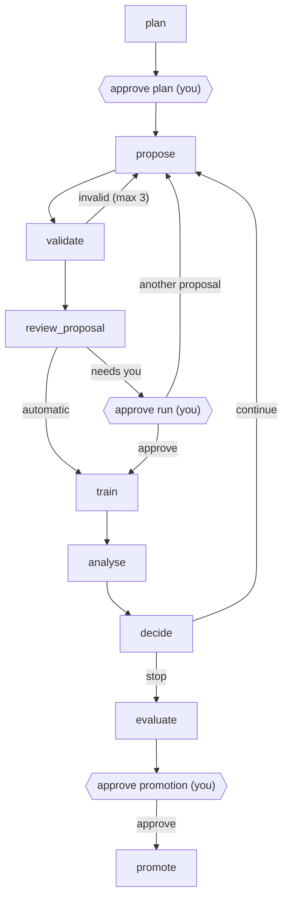

# DermaAgent

**Human-supervised multi-agent deep learning for dermatological image classification.**
Research software of the AgenticDerma project. The full project proposal is in [project_proposal.md](project_proposal.md).

DermaAgent classifies dermoscopy images from the DermaMNIST benchmark into seven lesion classes, explains every result with cited sources, and trains the models that produce it. A small team of LangGraph agents divides the work. The Testing agent classifies each image with every trained model and combines their votes. The Reviewer agent checks that result against the evidence. The Training agent plans and runs new experiments. The Models agent answers questions about the available models from their validation metrics. A person approves every decision that should not be taken automatically.

> Research prototype. The models work on low-resolution benchmark images (28 × 28 and 224 × 224 pixels). Their output is not a diagnosis and must not guide the care of a real person.

```bash
pip install -r requirements.txt
python run.py            # starts the platform and opens it in the browser
```

---

## Contents

1. [What the project does](#1-what-the-project-does)
2. [How it works](#2-how-it-works)
3. [Project structure](#3-project-structure)
4. [Installation](#4-installation)
5. [Running](#5-running)
6. [Using the platform](#6-using-the-platform)
7. [Language models: switching and adding providers](#7-language-models-switching-and-adding-providers)
8. [Training models](#8-training-models)
9. [Testing a final model](#9-testing-a-final-model)
10. [Outputs](#10-outputs)
11. [Data, models and evaluation](#11-data-models-and-evaluation)
12. [Technical reference](#12-technical-reference)
13. [Status and results](#13-status-and-results)
14. [Limitations](#14-limitations)
15. [Team and references](#15-team-and-references)

---

## 1. What the project does

A DermaMNIST model can report a strong test score and still be unreliable. The dataset contains duplicate images and leakage between splits, and it is strongly imbalanced: melanocytic nevi are 67 % of the training images, dermatofibroma and vascular lesions about 1 % each. A model that always answers "nevus" reaches 67 % accuracy. Generated explanations add a second risk when they are not tied to the model's evidence. An agent that trains and deploys models by itself adds a third: a model can reach the prediction system without anyone having checked that it improves it.

DermaAgent automates the whole workflow and keeps those risks under the control of code and of a person:

| Task | What the system does |
| --- | --- |
| **Classify** | Runs every trained model on each image, combines them with a weighted vote, rates the confidence with a fixed rule, and cites clinical sources for the leading classes. |
| **Review** | Checks each result with automatic checks and an independent literature search, names the model that drove the decision, and flags anything a person should look at. |
| **Train** | Plans a training campaign, proposes and runs each experiment, reads the training curves, and proposes the best model for the ensemble. |
| **Test** | Scores a final model once on the held-out test split, which no agent ever reads. |
| **Explain** | Answers questions about results, metrics and the system in the chat, and shows exactly what each language model received. Questions about the models (metrics, ROC curves, why a run is excluded) are answered from facts computed in code. |

**The guiding rule: numbers come from code, language comes from the language model.** Probabilities, votes, validation metrics, training diagnoses and promotion scores are computed in Python before any language model writes text. The language model reasons over that evidence, and deterministic checks reject anything it claims that the evidence does not support. Without a language model, classification, review and training still run, with fixed rules in its place. Only free-text requests and questions in the chat need one.

---

## 2. How it works



| Agent | Folder | Role |
| --- | --- | --- |
| **Orchestrator** | `system/orchestrator/` | Routes each request. Images go to prediction without any language-model call. A written request is read by a language model with structured output: classify, train (with the constraints you stated: architecture, minutes, number of runs, autonomy), a question about the models (sent to the Models agent), or any other question (answered from the system state and the latest result). When the intent is unclear it asks. It runs the other agents and passes their pauses to you. |
| **Testing agent** | `system/tester/` | Runs every model on each image. The **soft vote** (probabilities weighted by each model's validation balanced accuracy above chance) decides. The **hard vote** (each model's choice weighted by its validation precision for that class) checks for majority-class bias. The **most confident model** is reported but never decides alone. It recalls past analyses of the same image, retrieves clinical passages, and writes a rationale. The language model never sees the image and can change the class only to one the models support. |
| **Reviewer agent** | `system/reviewer/` | Reads the Testing agent's full trace, runs automatic checks, searches the literature independently, and identifies the decisive model. A warning or critical finding marks the image for your review. |
| **Training agent** | `system/trainer/` | Plans a campaign, proposes each run (architecture, hyperparameters, class weighting, augmentation justified for dermoscopy), trains until the validation metric plateaus, analyses the curves and proposes the next step. A candidate joins the ensemble only if it improves it on validation data **and** you approve. |
| **Models agent** | `system/informer/` | Answers questions about the available models and their data: characteristics, validation accuracy, macro-F1, AUC and ROC curves, why a run is excluded, what the validation set contains, how the vote and the promotion work. The facts and every chart are computed in code from validation data only; a language model writes the answer, and a check in code rejects any figure or run name that is not in the facts. Read-only. See [section 12](#models-agent). |
| **Platform** | `system/ui/` | The web interface where everything is done. |

### Where you decide

| Decision | When |
| --- | --- |
| Accept or reject flagged predictions | When the Reviewer flags a result and "Ask me before accepting flagged results" is on (default). |
| Approve the training plan | Always. You can edit budget, architecture, autonomy and metric first. |
| Approve a training run | When the run goes beyond the autonomy level, or the training reviewer raised a warning. |
| Promote a model into the ensemble | Always. |
| Clarify an ambiguous request | When the Orchestrator cannot tell what you meant. |

With no person available (for example on the command line with input closed), an escalated decision is recorded as **rejected**, never as accepted.

| Autonomy of a campaign | Runs without asking you |
| --- | --- |
| `supervised` | None: you approve every run. |
| `guarded` (default) | Same architecture with only learning rate (×0.3 to ×3), weight decay (×0.1 to ×10) or epochs changed. |
| `autonomous` | Everything within the budget. |

---

## 3. Project structure

```text
DermaMNIST-agentic_project/
├── run.py                  the single entry point
├── README.md
├── project_proposal.md     project proposal (also .docx)
├── USE_CASES.md            use cases of the system
├── pyramid_explanation.md  FPViT at 224 px: extractor, heads, pretrained vs scratch (in Italian)
├── requirements.txt
│
├── input/                  everything that goes in
│   ├── samples/            one example image per class (28 px), with labels.csv
│   ├── samples_224/        the same classes at 224 px, from the DermaMNIST-C test split
│   └── uploads/            images uploaded on the platform (created on use)
│
├── output/                 everything that comes out (created on use)
│   ├── predictions.jsonl   every prediction, per image
│   ├── reviews.jsonl       every review, with your decisions
│   ├── campaigns/          training campaigns of the Training agent
│   ├── runs/               manual training runs (they join the ensemble)
│   ├── runs_224/           runs trained outside the agent, e.g. on Colab (they join only through the promotion gate)
│   └── evaluations/        test-split reports
│
├── model/                  trained models used for prediction
│   ├── baseline/baseline_paper/best_model.pt   shipped: FPViT at 28 px, balanced accuracy 0.588 on DermaMNIST-C val
│   ├── baseline/baseline_paper/val_dermamnist_c.json   its cached scores on the common validation set
│   ├── promoted/           models trained by the agent and approved by you
│   └── ensemble_exclusions.json   runs left out of the ensemble, with the reason (edited by hand)
│
├── database/               data
│   ├── dermamnist/         DermaMNIST and DermaMNIST-C/E (downloaded on first use)
│   ├── clinical_kb.json    120 clinical passages (StatPearls, PubMed) for the Testing and Reviewer agents
│   └── training_kb.json    22 arXiv abstracts and project notes for the Training agent
│
└── system/                 the code
    ├── paths.py            every folder above, defined once
    ├── orchestrator/       routing, questions, human review, review log
    ├── tester/             Testing agent: model loading, voting, memory, retrieval, rationale
    ├── reviewer/           Reviewer agent: automatic checks, independent retrieval, report
    ├── trainer/            Training agent: plan, propose, validate, train, analyse, promote
    ├── informer/           Models agent: model facts, validation metrics, ROC curves, answer check
    ├── nets/               networks and training engine: FPViT (28 and 224 px), ResNet-18, EfficientNet-B0, ConvNeXt-Tiny, data, augmentation, metrics
    ├── notebooks/          Colab training of FPViT at 224 px; test of the 224 px models (in Italian)
    ├── llm/                language-model providers
    ├── ui/                 the platform: server and pages
    ├── config/llm.json     providers and default model (saved keys go to config/secrets.json)
    ├── train.py            one training run
    ├── predict.py          one model on an image or a folder
    └── evaluate.py         isolated test-split evaluation
```

---

## 4. Installation

Requirements: Python 3.10 or newer. A GPU is optional: training picks CUDA, then Apple MPS, then CPU. Prediction runs comfortably on CPU.

```bash
cd DermaMNIST-agentic_project
python -m venv .venv
source .venv/bin/activate          # Windows: .venv\Scripts\activate
pip install -r requirements.txt
```

The DermaMNIST dataset (about 20 MB) is downloaded into `database/dermamnist/` the first time training or a test evaluation needs it. The 28 px DermaMNIST-C file (about 21 MB, from Zenodo, MD5-checked) is downloaded there the first time a model has to be scored on the common validation set; the shipped model already has its scores cached. The 28 px DermaMNIST-E file (about 25 MB) is downloaded for an external test, and the 224 px releases (about 1.1 GB for C, 1.3 GB for E) only when a 224 px model is trained, scored or tested. Prediction needs nothing else: the shipped model and the sample images are enough.

A language model is optional (see [section 7](#7-language-models-switching-and-adding-providers)). The quickest options:

```bash
export ANTHROPIC_API_KEY=sk-ant-...        # Claude
ollama pull qwen2.5:3b                      # or a local model with Ollama (https://ollama.com)
```

---

## 5. Running

```bash
python run.py                   # start the platform and open http://127.0.0.1:8000
python run.py --port 8080       # another port
python run.py --no-browser      # do not open the browser
```

`run.py` checks the Python version and the installed packages first and tells you what is missing. Everything is done from the platform: classification, review, training, promotion, test evaluation, questions, and language-model setup. Stop it with Ctrl+C.

The same tools are available from `run.py` for scripting or for a machine without a browser:

| Command | Does |
| --- | --- |
| `python run.py orchestrator input/samples --no-llm` | Classify and review images. Add `--ask-human` to be asked about flagged results, `-v` to trace every step, `--json` for structured output, `--train "request"` to enable training, or a question in quotes. |
| `python run.py tester input/samples --no-llm` | Testing agent alone. |
| `python run.py trainer "improve dermatofibroma" --minutes 30` | A training campaign; approvals are asked in the terminal. `--no-llm` uses the rule-based policy. |
| `python run.py train --arch resnet18 --epochs 5` | One manual training run into `output/runs/`. |
| `python run.py predict --image input/samples --labels input/samples/labels.csv --checkpoint model/baseline/baseline_paper/best_model.pt` | One model on images, scored against labels. |
| `python run.py evaluate --checkpoint <path>/best_model.pt` | Isolated test-split evaluation. `--dataset dermamnist_e` tests on the external ISIC 2018 split. |
| `python run.py promote output/runs_224/<run>` | Promotion gate for a model trained outside the Training agent (e.g. on Colab): compares the ensemble with and without it on DermaMNIST-C val and asks you in the terminal. `--dry-run` only evaluates. |
| `python run.py llm` / `llm test <model>` / `llm default <model>` | Language-model providers. |
| `python run.py build-kb` | Rebuild `database/training_kb.json` from arXiv (needs internet). |

Every tool takes `--help`. `--model` takes `provider:model`, `auto` (the default model; the default value), or use `--no-llm`.

---

## 6. Using the platform

### Start here

The welcome screen shows the three things you can do, with examples, and the seven sample images. Click **Try the 7 sample images** to see a full analysis. If a result is flagged, a dialog asks you to accept or reject it.

### The message box does four things

| You type | What happens |
| --- | --- |
| Images (attach with **+**, drag onto the page, or paste) and an optional note | The images are classified and reviewed. The note is passed to the agents as context. |
| A training request in plain words, e.g. *"Train a ResNet-18 for 20 minutes to improve dermatofibroma, ask me before every run"* | The Orchestrator reads the constraints and starts a campaign. The plan opens for your approval. *Needs a language model.* |
| A question, e.g. *"Why is the confidence of image 1 low?"* | The answer uses the latest result, the recent conversation and the system state. *Needs a language model.* |
| A question about the models, e.g. *"Which model is best on melanoma?"* or *"What does the validation set contain?"* | The Models agent answers from facts computed in code and checks every figure; the answer comes with a metrics table, recall per class, ROC curves and the ensemble's confusion matrix. *Needs a language model to be routed; without one, use `/models` → Metrics and ROC curves.* |

### Commands

Commands work with or without a language model. Type `/` to open the list; pick with the arrow keys and Enter.

| Command | What it does |
| --- | --- |
| `/help` | What you can do, and every command. |
| `/samples`, `/sample <name>` | Classify all sample images, or one (e.g. `/sample melanoma`). |
| `/train` | Opens the training form. |
| `/train [goal] [options]` | Starts a campaign directly. Options: `arch=` (fpvit, resnet18, efficientnet_b0, convnext_tiny), `runs=`, `minutes=`, `epochs=` (per run), `patience=`, `autonomy=` (supervised, guarded, autonomous), `metric=` (balanced_acc, macro_f1, macro_auc), `target=`. Example: `/train arch=resnet18 runs=3 minutes=30 improve dermatofibroma recall` |
| `/explain` | Explains the latest result: written by the language model, or a rule-based summary without one. |
| `/models` | The models in the ensemble: validation balanced accuracy, vote weight, classes they never predict. **Metrics and ROC curves** runs the Models agent (works without a language model: the answer is then the summary computed in code). |
| `/evaluate` | Tests a final model on the held-out test split (see [section 9](#9-testing-a-final-model)). |
| `/status` | Ensemble, knowledge base, logs, language models and agent settings. |
| `/approve [note]`, `/reject [note]` | Answers the pending decision. |
| `/activity` | Opens the activity panel. |
| `/settings`, `/llm` | Agent settings; language-model providers. |
| `/about`, `/clear` | Project presentation; new conversation. |

### While a task runs

A progress card in the conversation shows the current step, the elapsed time and the state of each agent. **Activity** opens the details:

- **Agent graph:** each agent and its steps, lit as they run. Steps marked *inputs* open a window with exactly what the language model received: system prompt, data, retrieved passages and its raw answer.
- **Training progress:** one curve per run (validation balanced accuracy, and training loss dashed), updated every epoch, and a table of every run with its settings, reason, result and diagnosis.
- **What happened:** every step of every agent, newest first.
- **Memory and models:** the logs, the clinical knowledge base (click to browse and search it) and the models with their vote weights.

### Decisions

When an agent needs you, the progress card turns amber and a dialog opens with the evidence and the reason a person is needed:

- **Flagged results:** each flagged image with its findings. Accept or reject, with an optional note.
- **Training plan:** goal, current ensemble and its weakest classes, and an editable plan.
- **Training run:** the proposal, its reason, the augmentation and why it suits dermoscopy, what changed, why your approval is needed, and the training reviewer's findings. Approve, ask for another proposal (your note is passed on), or stop.
- **Promotion:** the ensemble's validation balanced accuracy with and without the candidate, and the change in recall for each class.

**Decide later** keeps the task paused; answer later from the progress card, **Activity**, or `/approve` and `/reject`.

### Settings

| Setting | Effect |
| --- | --- |
| Testing, Reviewer, Training agent model | "Default model", a specific model, or none (rule-based). A Reviewer model different from the Testing agent's gives a more independent review. |
| Ask me before accepting flagged results | Pause on flagged results (on by default). |
| Include a step-by-step account | The Reviewer opens the answer with a short account of what each agent did. |
| Leave out weak models | Exclude models under a validation balanced accuracy threshold. |

---

## 7. Language models: switching and adding providers

A model is addressed as **`provider:model`**: `anthropic:claude-opus-5-5`, `ollama:qwen2.5:3b`, `openrouter:qwen/qwen3-235b-a22b`, `groq:<model>`...

Providers are declared in `system/config/llm.json`. Three kinds cover almost every service:

| Kind | Covers |
| --- | --- |
| `anthropic` | Claude models (`claude-opus-5-5`, `claude-sonnet-5-5`, `claude-haiku-4-5`) |
| `openai` | OpenAI and every OpenAI-compatible API: OpenRouter, Groq, DeepSeek, Mistral, Together, Google Gemini (OpenAI endpoint), LM Studio, vLLM |
| `ollama` | Local models from `ollama serve`, on this or another machine (installed models are detected automatically) |

**In the platform** (Settings → Language models, or `/llm`):

- Each provider card shows whether it is ready and why not. **Add API key** stores the key in `system/config/secrets.json` (local, file mode 600, never sent back to the page). **Load models** asks the provider for its list; click a model to add it. **Test** sends one short request. **Edit** and **Remove** change the provider.
- **Default model** is used by every agent set to "Default model"; "Automatic" picks the first ready model.
- **Add a provider** from a template (Groq, DeepSeek, Mistral, Google Gemini, Together AI, LM Studio, vLLM, a remote Ollama) or a blank form.
- To switch the model of an agent, open Settings → Agents; the next task uses it.

**In the terminal:** `python run.py llm`, `python run.py llm test anthropic:claude-opus-5-5`, `python run.py llm default ollama:qwen2.5:3b`. Environment variables (`ANTHROPIC_API_KEY`, `OPENAI_API_KEY`, `OPENROUTER_API_KEY`, or the variable named in a provider's `api_key_env`) take precedence over saved keys; `OLLAMA_HOST` overrides the Ollama address.

**By editing `system/config/llm.json`:**

```json
{
  "default_model": "anthropic:claude-opus-5-5",
  "providers": [
    {"id": "anthropic", "label": "Anthropic (Claude)", "kind": "anthropic",
     "api_key_env": "ANTHROPIC_API_KEY", "models": ["claude-opus-5-5", "claude-sonnet-5-5"]},
    {"id": "groq", "label": "Groq", "kind": "openai", "base_url": "https://api.groq.com/openai/v1",
     "api_key_env": "GROQ_API_KEY", "models": ["<model id>"]},
    {"id": "lmstudio", "label": "LM Studio", "kind": "openai", "base_url": "http://127.0.0.1:1234/v1",
     "requires_key": false, "models": ["<model id>"]}
  ]
}
```

Optional fields: `options` (extra chat-model arguments, e.g. `{"temperature": 0}`) and `requires_key: false` for local servers. The file is re-read when it changes.

**What the model must support.** The agents ask for structured output (a JSON schema). Claude, OpenAI and most hosted models support it; Ollama constrains the output to the schema. Very small models may still reason poorly; when a call fails, the agent falls back to its rules and the activity panel says so. To add a new kind of provider in code, extend `build_chat_model` and `structured` in `system/llm/registry.py`; nothing in the agents changes.

---

## 8. Training models

### With the Training agent (recommended)

Use the **Train** button, `/train`, a request in plain words, or `python run.py trainer`. Every run is written to a new folder in `output/campaigns/<campaign>/`; nothing enters the prediction ensemble without your approval.



Without a language model, a rule-based policy proposes: first run with `effective` class weights; on a plateau, continue from the best checkpoint with the learning rate ×0.3; on overfitting, weight decay ×3; a class at zero recall switches to `inverse` weights; two runs without gain stop the campaign. A promoted model is copied to `model/promoted/` and votes from the next analysis.

### By hand

```bash
python run.py train --arch resnet18 --optimizer adamw --lr 3e-4 --epochs 30 \
    --class-weight effective --select-on balanced_acc --early-stop-patience 5 --out output/runs/resnet18
python run.py train --out output/runs/resnet18 --resume      # continue an interrupted run
```

Any `output/runs/<name>/best_model.pt` joins the ensemble at the next analysis. All options are in [section 12](#trainpy-options).

**At 224 px on the leakage-free DermaMNIST-C.** FPViT switches to the ImageNet stem and a 14 × 14 token grid per head; `--pretrained` starts its ResNet-18 extractor from ImageNet weights:

```bash
python run.py train --dataset dermamnist_c --img-size 224 --pretrained \
    --optimizer adamw --lr 3e-4 --backbone-lr-mult 0.1 --warmup-epochs 3 \
    --amp --batch-size 64 --out output/runs_224/fpvit_c224_pre_s42
python run.py promote output/runs_224/fpvit_c224_pre_s42
```

A GPU is needed in practice. `system/notebooks/fpvit_224_dermamnist_c.ipynb` runs the ablation (from scratch vs ImageNet-pretrained, 3 seeds each) on Colab, resumable after a disconnection; copy its runs into `output/runs_224/` and promote them. `output/runs_224/` is not scanned by the Testing agent, so these models vote only after the gate and your approval. `system/notebooks/evaluate_224_models.ipynb` tests them on the DermaMNIST-C and -E test splits, once model selection is finished.

---

## 9. Testing a final model

The test split is read by one piece of code only: the isolated evaluation. No agent and no training step can reach it. Run it **once, on the model you have decided to keep**, after all training and selection are finished. Looking at test results while still choosing models leaks test information into the choice.

In the platform, type `/evaluate` (or use **Test evaluation** after `/models`), choose the model, and confirm. The result card shows balanced accuracy, macro-F1, macro AUROC, accuracy and recall per class, and the report is saved in `output/evaluations/<model>.json`. From the terminal: `python run.py evaluate --checkpoint model/<...>/best_model.pt`. The test split is the one of the dataset the model was trained on, at its own input size; `--dataset dermamnist_e` gives an external test (ISIC 2018, other lesions) for a model trained on the official split or on DermaMNIST-C. Never test a model trained on DermaMNIST-E on the official or C test split: its training set contains those images.

---

## 10. Outputs

| Location | Content |
| --- | --- |
| `output/predictions.jsonl` | One line per image per analysis: every model's probabilities, the vote, the final class, the rationale, the models used. The Testing agent's memory (recall by the image's SHA-256). |
| `output/reviews.jsonl` | One line per analysis, linked by `execution_id`: automatic checks, reviewer findings, verdicts, decisive model, your decision and note. |
| `output/campaigns/<campaign>/<run>/` | Each training run: `best_model.pt`, `last_model.pt`, `experiment_record.json` (configuration, seed, per-epoch history, per-class metrics, stop reason), `metrics.csv`, `train.log`. |
| `output/campaigns/<campaign>/campaign.json` | The campaign record: plan, proposals, approvals, diagnoses, promotion evaluation. |
| `output/campaigns/campaigns.jsonl` | One line per run across campaigns: what changed and its effect. The Training agent learns from it. |
| `output/runs/<name>/` | Manual training runs (same files). |
| `output/runs_224/<name>/` | Runs trained outside the agent (same files), waiting for the promotion gate. |
| `<run folder>/val_dermamnist_c.json` | Next to every ensemble checkpoint: its metrics and per-image probabilities on DermaMNIST-C val, keyed by the checkpoint's SHA-256. Computed once, reused by the vote, the promotion gate and the Models agent. |
| `output/evaluations/<model>.json` | Test reports: metrics, per-class precision, recall, F1, confusion matrix. `<model>_<dataset>.json` for a test split other than the training one. |
| `model/promoted/<name>/`, `model/promoted/registry.jsonl` | Promoted models (copies) with SHA-256, evaluation and your decision. |
| `input/uploads/<job>/` | Images uploaded on the platform. |

Delete `output/` at any time to start from a clean state; it is recreated on use.

---

## 11. Data, models and evaluation

**Data.** DermaMNIST from MedMNIST v2: 10,015 dermoscopy images from HAM10000, seven classes, official split 7,007 / 1,003 / 2,005 (train / validation / test). Training class counts: 228, 359, 769, 80, 779, 4,693, 99. The official split was made per image, but HAM10000 holds several images of the same lesion, so the same lesion sits in train, validation and test [2]. `train.py --dataset` also offers the corrected releases of [2], at 28 or 224 px (the 224 px images are resized directly from the originals):

| `--dataset` | Split | Train / val / test |
| --- | --- | --- |
| `dermamnist` (default) | official, per image | 7,007 / 1,003 / 2,005 |
| `dermamnist_c` | lesion-level: every image of a lesion in train is moved into train | 8,215 / 573 / 1,227 |
| `dermamnist_e` | train = all of HAM10000, val/test = ISIC 2018 | 10,015 / 193 / 1,511 |

A model trained on C can be tested on C and, externally, on E. The reverse does not hold: E's train split contains every image of C's validation and test splits. The Training agent still trains on the official split.

**Common validation set.** The ensemble's vote weights, the promotion gate and the Models agent score every model on **DermaMNIST-C val** (573 images), each at its own input size and normalisation. A checkpoint's own validation metrics are not comparable across models trained on different splits or sizes. C-val is clean for models of the official split and of C; a model trained on E is refused. One bias remains: C-val is a subset of the official validation split, on which the official-split models chose their best epoch, so their numbers are slightly optimistic.

| Id | Class | Id | Class |
| --- | --- | --- | --- |
| 0 | actinic keratoses / intraepithelial carcinoma | 4 | melanoma |
| 1 | basal cell carcinoma | 5 | melanocytic nevi |
| 2 | benign keratosis-like lesions | 6 | vascular lesions |
| 3 | dermatofibroma | | |

**Models.** FPViT (a ResNet-18 extractor with shallow transformer heads on three stages plus a ResNet head, fused for classification; about 16.9 M parameters) and three CNNs adapted to 28 × 28: ResNet-18, EfficientNet-B0, ConvNeXt-Tiny. At 224 px FPViT uses the ImageNet stem (224 → 56 → 28 → 14 → 7) and groups feature-map locations so that every transformer head sees a 14 × 14 grid of tokens; with `--pretrained` its extractor is torchvision's ImageNet ResNet-18 (ImageNet only: no dermatology data, no leakage). The CNNs stay at 28 px. See [pyramid_explanation.md](pyramid_explanation.md).

**Resolution rule.** Every model receives an image resized to its own input. A model does not vote on an image smaller than its input: measured on the DermaMNIST-C test, 224 px models shown 28 px images upsampled to 224 answer "nevus" for 95 % of them, and with their high weight they drag the ensemble's balanced accuracy from 0.53 to 0.28. So on a 28 px image only the 28 px models vote; on a 224 px image all vote. If an image is smaller than every model's input, all vote and the Reviewer raises a warning.

**Exclusions.** A run listed in `model/ensemble_exclusions.json` is left out of the ensemble, with the reason written there. Only a person edits that file.

**Augmentation for dermoscopy.** Flips and 90° rotations are always allowed (lesions have no canonical orientation). Hue jitter is capped, because colour separates melanoma, nevi and keratoses. No operation fills borders with black, which would imitate dermatoscope vignetting. Stronger crops and cutout are used only against measured overfitting.

**Metrics.** Balanced accuracy (mean per-class recall) is the main metric, with macro-F1, macro one-vs-rest AUROC, per-class precision, recall and F1, and the confusion matrix. Accuracy is reported but never used for selection.

**Confidence rule.** High when the soft vote, the hard vote and the most confident model agree, the gap to the second class is at least 0.25 and the soft vote is at least 0.5. Low when soft and hard votes disagree or the gap is below 0.10. Medium otherwise.

**Promotion gate.** The ensemble is scored on DermaMNIST-C val with and without the candidate, every model at its own input size. A gain below 0.005 in balanced accuracy is treated as noise. Absolute numbers are optimistic, because vote weights come from the same validation images, but the with/without comparison is fair. Models trained outside the Training agent go through the same gate with `python run.py promote`.

**Knowledge bases.** `database/clinical_kb.json`: 120 passages from nine sources (five StatPearls chapters and four journal articles indexed in PubMed), searched with TF-IDF and class-specific query expansion; every citation is verified in code. `database/training_kb.json`: 22 verified arXiv abstracts on imbalance, optimisation, augmentation and architectures, plus project notes.

---

## 12. Technical reference

### Reviewer checks

| Check | Severity |
| --- | --- |
| The rationale describes the image, which the Testing agent cannot see | critical |
| Melanoma and nevus are the two leading classes with a margin below 0.20 | critical |
| The rationale changed the voted class | warning |
| Stated confidence higher than the vote supports | warning |
| Low confidence | warning |
| Cited passages that were not provided | warning |
| A past analysis of the same image reached a different class | warning |
| The language model failed, or an override was rejected | warning |
| The image is smaller than the input of every model (all votes out of distribution) | warning |
| The image is too small for some models, which did not vote | info |
| The image was resized to the models' inputs | info |
| The strongest model never predicts the final class | info |
| Melanoma among the two leading classes | info |
| The knowledge base holds little on the final class | info |

The language model may change the voted class only to a class with at least 0.15 soft-vote probability or at least one model's vote; any other change is rejected in code and logged.

### Training agent controls

- **Validation** (`system/trainer/space.py`): bounds, learning rate per optimizer, class weight and balanced sampler as alternatives, valid augmentation, warm restart on the same architecture, no repeated configuration.
- **Training reviewer** (`system/trainer/review.py`) flags a proposal that claims to fix a problem the facts do not show, changes more than two things at once, strengthens augmentation during underfitting, raises hue jitter, states choices in its reason that its fields do not contain, cites passages it was not given, or repeats a change that made an earlier campaign worse.
- **Facts computed in code** (`system/trainer/analysis.py`): train/validation gap, plateau, overfitting, collapsed classes. The language model's analysis cannot contradict them.
- **Nothing is overwritten:** each run writes a new folder; promotion copies the checkpoint under a new name. The promotion check reads only the validation arrays of the dataset.

### train.py options

| Option | Default | Meaning |
| --- | --- | --- |
| `--arch` | `fpvit` | `fpvit`, `resnet18`, `efficientnet_b0`, `convnext_tiny` |
| `--epochs`, `--batch-size` | 100, 128 | |
| `--optimizer`, `--lr`, `--weight-decay` | `sgd`, 1e-3, 0.05 | The paper recipe is SGD at 1e-3; AdamW at about 3e-4 is usually stronger |
| `--embed-dim`, `--depth`, `--num-heads`, `--no-resnet-head` | 192, 4, 3, off | FPViT only |
| `--class-weight`, `--cb-beta` | `none`, 0.999 | `inverse` or `effective` weights in the training loss only |
| `--balanced-sampler` | off | Class-balanced resampling; an alternative to class weights, not a complement |
| `--select-on` | `macro_auc` | Metric that selects `best_model.pt`: `balanced_acc`, `macro_f1`, `macro_auc`, `acc`, `loss` |
| `--early-stop-patience`, `--early-stop-min-delta` | 0 (off), 0 | Stop after N epochs without improvement |
| `--max-seconds` | none | Time budget; stops before an epoch expected to overrun |
| `--aug-preset` | `default` | `none`, `dihedral`, `default`, `strong`, `paper` |
| `--aug-config`, `--aug-set key=value`, `--no-cutout` | | Augmentation as JSON (or a previous `experiment_record.json`), single-field overrides |
| `--seed`, `--num-workers`, `--device` | 42, 4, `auto` | `auto` picks CUDA, then MPS, then CPU |
| `--dataset` | `dermamnist` | `dermamnist`, `dermamnist_c`, `dermamnist_e` (see [section 11](#11-data-models-and-evaluation)) |
| `--img-size` | 28 | 28 or 224; the CNNs are 28 only |
| `--stem`, `--token-grid` | `auto`, -1 (auto) | FPViT: `small` stem up to 64 px, `imagenet` above; token grid side per head, 0 = one token per location (the paper), auto = 0 with the small stem, 14 with the imagenet stem |
| `--pretrained` | off | FPViT extractor from ImageNet ResNet-18 weights; needs the imagenet stem |
| `--norm` | `auto` | `imagenet` with `--pretrained`, otherwise `dermamnist` |
| `--backbone-lr-mult` | 1.0 | Learning rate of the extractor = lr × mult (e.g. 0.1 with `--pretrained`) |
| `--warmup-epochs` | 0 | Linear warm-up from 0.1 × lr before the cosine decay |
| `--amp`, `--grad-clip`, `--label-smoothing` | off, 0, 0 | Mixed precision (CUDA only); maximum gradient norm; label smoothing of the training loss |
| `--data-root` | `database/dermamnist` | Dataset folder |
| `--out` | `output/runs/fpvit_dermamnist` | Run folder |
| `--resume`, `--init-from CHECKPOINT` | | Continue a run; start from another run's weights in a new folder |
| `--no-progress`, `--log-file` | | For background runs |

Every `auto` value is resolved before the run and stored in the checkpoint's config, so a checkpoint always rebuilds with the shape and preprocessing it was trained with; older checkpoints without these keys load as 28 px models. `stop_reason` in `experiment_record.json` is `completed`, `early_stop`, `max_seconds` or `interrupted`. Each epoch prints per-class validation recall, which shows at once when a model collapses onto the majority class.

### Models agent

`system/informer/` answers questions about the models. It is read-only: no interrupt, no file written, no model touched. The Orchestrator calls it when the router reads a request as a question about the models, when you choose "Show the available models" in the clarification dialog, or directly with `/models` → **Metrics and ROC curves**. On the platform it takes no lock, so it never waits behind a training campaign.

```text
START -> collect_facts -> explain -> check_claims -> END
```

| Node | Who | What it does |
| --- | --- | --- |
| `collect_facts` | code (`facts.py`) | The facts of the ensemble members and of the excluded runs: architecture, input size, training data, ImageNet pre-training, parameters, optimizer, epochs, vote weight, classes never predicted, promotion (from the registry) and exclusion (from `model/ensemble_exclusions.json`). Metrics on DermaMNIST-C val from the cached per-image probabilities, without new inference: accuracy, balanced accuracy, macro-F1, macro-AUC, per-class precision, recall, F1 and AUC. The same for the ensemble (weighted soft vote), plus one-vs-rest ROC curves and confusion matrices, the class counts of the datasets and the rules of the system. |
| `explain` | language model | Answers the question from the facts only. Without a language model the answer is the summary computed in code. |
| `check_claims` | code | Every number and every name with an underscore (runs, datasets, metrics) in the answer must appear in the facts or the question. Numbers are compared at the precision they are written with (0.76 matches 0.756, and so does 75.6 %). If anything does not match, you see the summary computed in code and the list of rejected claims. |

The agent never reads the test split, not even its labels: class counts come from the train and validation splits only, and the reasons in `model/ensemble_exclusions.json` must cite validation numbers only, because they reach the language model.

Known limits: the check verifies that every number exists in the facts, **not** that it is attributed to the right model; new computations (differences, averages) and invented numbers are rejected. Names without an underscore (e.g. `probe`) are not checked. With a small local model an answer takes about two minutes.

### Platform HTTP API

The server (`system/ui/app.py`) is a standard-library HTTP server bound to 127.0.0.1. The live view comes from LangGraph's task stream (`stream_mode=["tasks", "custom"], subgraphs=True`); pauses are LangGraph interrupts resumed with `Command(resume=...)`. POST requests must be JSON from a local page, which blocks cross-site requests. There is no authentication: do not expose it to a network.

| Endpoint | Purpose |
| --- | --- |
| `GET /`, `/about`, `/context`, `/kb` | Pages |
| `GET /api/health` | Models, knowledge base, language models, logs, samples |
| `POST /api/run` | Start a job: images `{samples, uploads, request, settings}`, training `{mode: "train", request, train, settings}`, the Models agent `{mode: "models", request, settings}`, or free text `{request, contextJob, history, settings}` |
| `GET /api/status?id=` | Job state, graph, activity, training curves, pending decision, result |
| `POST /api/resume` | `{job, decision, note, edits}`: answer the pending decision |
| `GET /api/context?job=&step=` | What the language model received in a step |
| `GET /api/kb`, `/api/kb/search?q=` | Clinical knowledge base |
| `GET /api/evaluations`, `POST /api/evaluate` | Test reports; `{model}` starts an evaluation |
| `GET /api/providers`, `POST /api/providers[/key\|/models\|/test\|/default\|/delete]` | Provider management |

### Python use

```python
import sys; sys.path.insert(0, "system")
from orchestrator import build_orchestrator
from langgraph.types import Command
app = build_orchestrator(model="auto", ask_human=True, with_trainer=True)
cfg = {"configurable": {"thread_id": "t1"}}
out = app.invoke({"image_paths": ["input/samples"]}, cfg)
while out.get("__interrupt__"):
    out = app.invoke(Command(resume={"decision": "accepted", "note": ""}), cfg)
print(out["report"])
```

---

## 13. Status and results

| Component | Status |
| --- | --- |
| Orchestrator, Testing, Reviewer, Training and Models agents with human approvals | Implemented; verified end to end with the rule-based policy and with a local language model |
| Platform: chat and commands, prediction, training, promotion, test evaluation, model metrics and ROC curves, explainability, provider management | Implemented; verified in a browser |
| FPViT and three CNNs at 28 px; FPViT at 224 px on DermaMNIST-C | Implemented; 2 of the 6 ablation runs at 224 px completed on Colab (ImageNet-pretrained, seeds 42 and 43); the from-scratch runs and seed 44 are open |
| Common validation set (DermaMNIST-C val), resolution rule, exclusions, promotion from the command line | Implemented |
| Models agent (facts, metrics, ROC curves, checked answers) | Implemented |
| Calibration (temperature scaling), ensemble freeze manifest, Grad-CAM attribution | Planned |

The shipped `baseline_paper` model reaches a balanced accuracy of 0.588 on DermaMNIST-C val (0.533 on the official validation split); on the seven sample images it classifies 3 correctly (it never predicts dermatofibroma). The project team's ensemble of two 28 px models and one ImageNet-pretrained 224 px FPViT (promoted on 2026-09-29) reaches 0.798 on DermaMNIST-C val (the 224 px FPViT alone: 0.756). Only `baseline_paper` ships with this folder; the other models must be trained, or copied into `output/runs_224/` and promoted. On a 28 px image only the 28 px models vote, so the best answers need 224 px images such as those in `input/samples_224/`. In a verified rule-based campaign (measured on the official validation split, before the common validation set was introduced), the Training agent raised a ResNet-18 from 0.396 to 0.505 validation balanced accuracy, and the ensemble with that candidate from 0.501 to 0.535.

---

## 14. Limitations

- 28 × 28 images carry little detail; any visual attribution at this size is coarse evidence. The 224 px models need 224 px images.
- The official DermaMNIST split contains duplicates and leakage. The ensemble is weighted and gated on DermaMNIST-C val and `train.py --dataset dermamnist_c` trains on the corrected split, but the Training agent still trains on the official one.
- DermaMNIST-C val is small: 5 dermatofibroma and 7 vascular lesion images, so one image moves their recall by 0.2 or 0.14.
- For the same reason, differences below about 0.01 in balanced accuracy are noise.
- Vote weights and promotion scores use the validation split, so absolute validation numbers are optimistic.
- Small local language models may produce weak reasoning; the agents fall back to their rules when a call fails.
- The platform has no authentication; keep it on 127.0.0.1.

---

## 15. Team and references

| Name | Role | Responsibility |
| --- | --- | --- |
| Emanuele Damiano | Project Manager | Scope, work packages, interfaces, risks, final deliverables |
| Flavia Forte | Technical Responsible | Data pipeline, classifiers, agents, evaluation, platform, reproducibility |
| Abdelkader Messlem | Reviewer | Verification evidence, data and test isolation audits, KPI checks, acceptance |

1. J. Yang et al., "MedMNIST v2: A large-scale lightweight benchmark for 2D and 3D biomedical image classification," *Scientific Data*, 10, 41, 2023.
2. K. Abhishek, A. Jain and G. Hamarneh, "Investigating the Quality of DermaMNIST and Fitzpatrick17k Dermatological Image Datasets," *Scientific Data*, 12, 196, 2025.
3. P. Tschandl, C. Rosendahl and H. Kittler, "The HAM10000 dataset, a large collection of multi-source dermatoscopic images of common pigmented skin lesions," *Scientific Data*, 5, 180161, 2018.
4. J. Liu, Y. Li, G. Cao, Y. Liu and W. Cao, "Feature Pyramid Vision Transformer for MedMNIST Classification Decathlon," IJCNN, 2022.
5. Y. Cui, M. Jia, T.-Y. Lin, Y. Song and S. Belongie, "Class-Balanced Loss Based on Effective Number of Samples," CVPR, 2019.

The complete list of 22 references, the work plan and the risk register are in [project_proposal.md](project_proposal.md).
