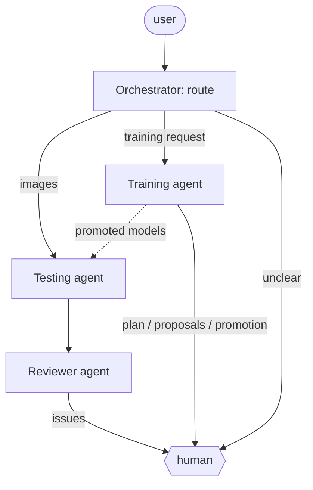

# DermaAgent

DermaAgent classifies dermoscopy images from the DermaMNIST benchmark into seven classes and trains the models that do it, through a small team of LangGraph agents with a human in the loop. The classifiers are trained locally: an FPViT (a feature pyramid vision transformer) and three CNNs adapted to 28×28 inputs. The agents decide how to use them, check each other's work, and ask a person whenever a decision should not be taken silently.

The system follows one rule throughout: **numbers come from code, language comes from the LLM**. Probabilities, votes, validation metrics, training diagnoses and promotion scores are computed in Python before any model writes text. The LLM reasons over that evidence and retrieved literature, and deterministic checks reject anything it claims that the evidence does not support. Without an LLM, prediction, review and training still run, and deterministic rules take the LLM's place.

## Agents

| Agent | Package | What it does |
| --- | --- | --- |
| **Orchestrator** | `orchestrator/` | Routes each request: images go to prediction, while a written request is read by an LLM with structured output (intent plus training constraints). When the intent is unclear, it asks instead of guessing. It runs the other agents as subgraphs and surfaces their `interrupt()`s to the human. |
| **Testing agent** | `predict_agent/` | Runs every local model on one or more images. Combines them with a skill-weighted soft vote and a precision-weighted hard vote, and looks at the most confident model. Reasons over deterministic memory (past executions of the same image) and stochastic memory (TF-IDF retrieval over the clinical knowledge base), then returns the final prediction. |
| **Reviewer agent** | `review_agent/` | Reads the tester's full trace. Checks it against the knowledge base with an independent retrieval and against deterministic checks (claims about the image, melanoma/nevus margin, overrides, overstated confidence, invented citations), and identifies the model that actually drove the decision. It escalates contradictions to the human; otherwise it summarises the reasoning for the user. |
| **Training agent** | `train_agent/` | Plans a training campaign and proposes each run: architecture, hyperparameters, class weighting, and augmentation justified for dermoscopy. It runs `train.py`, and when a run plateaus it diagnoses the curves and proposes the next step (new run, warm restart, stop). An autonomy gate decides which proposals need a human. The candidate enters the prediction ensemble only if it improves it on validation **and** a human approves. |
| **Platform** | `webapp/` | Local web UI. It shows the agent graph live, the communication trace, training curves per epoch, and a single human-decision dialog for every kind of interrupt. It also has explainability windows for the full LLM context and the knowledge base. |



The agents are independent compiled graphs, and each can also run on its own from the command line. The training agent never overwrites a model. Every run is written to a new folder, and a promotion **copies** the checkpoint under a new name into `models_promoted/`, the only folder of new models the testing agent reads. The test split is never used by the agents: promotion is decided on validation only.

## Quick start

```bash
python -m venv .venv && source .venv/bin/activate
pip install -r requirements.txt

python -m webapp                                          # platform on http://127.0.0.1:8000
python -m orchestrator test_samples --no-llm              # predict + review, no LLM needed
python -m orchestrator test_samples --model ollama:qwen3.6 -v --ask-human
python -m orchestrator --train "improve dermatofibroma recall, 30 minutes"
python -m train_agent --arch resnet18 --trials 3 --no-llm # training campaign, deterministic policy
```

DermaMNIST is downloaded by `medmnist` on first use (`~/.medmnist/`). LLMs are addressed as `provider:model`: Ollama locally (`ollama:qwen3.6`), Anthropic with `ANTHROPIC_API_KEY`, or OpenRouter with `OPENROUTER_API_KEY`.

**One model ships with the repository**: `baseline_paper` (FPViT with the paper's hyperparameters, 65 MB), so a fresh clone runs the whole system. The testing agent loads every `*/best_model.pt` it finds under `runs/`, `runs_agent/`, `runs test solo training pyramid/` and `models_promoted/`, except the runs listed in `ensemble_exclusions.json`. Every model is weighted by its metrics on a common validation set, DermaMNIST-C val, measured at its own input size (28 or 224 px) and cached next to the checkpoint in `val_dermamnist_c.json`. A model does not vote on an image smaller than its own input. Models trained outside the training agent, for example on Colab, enter through the same promotion gate: `python -m train_agent.promotion <run folder>`. To train more:

```bash
python train.py --out runs/fpvit_run                   # FPViT, paper hyperparameters by default
python train.py --arch resnet18 --out runs/resnet18
```

## Repository layout

```text
fpvit/            FPViT and the CNN baselines (model zoo), data, augmentation, training engine
train.py          training entry point used by hand and by the training agent
predict.py        single-model prediction; evaluate_test.py: manual test-split evaluation
predict_agent/    testing agent        review_agent/  reviewer agent
orchestrator/     routing + human-in-the-loop       train_agent/   training agent + training KB
webapp/           platform (stdlib HTTP server, no build step)
simple_agent/     first LangGraph agent; its build_llm is reused by the agents
corpus.json       clinical knowledge base for the seven classes
colab/            Colab notebook: FPViT at 224 px on the leakage-free DermaMNIST-C
legacy_first_agent/   the project's first agent prototype, not used by the system
test_samples/     one example image per class (28 px); test_samples_224/: the same at 224 px, from the DermaMNIST-C test
ensemble_exclusions.json   runs left out of the ensemble, with the reason
```

Each package documents its design, the checks it runs and what was verified in its README (the reviewer agent is covered in `orchestrator/README.md`). The FPViT implementation, augmentation, training options and hyperparameters are documented in [`fpvit/README.md`](fpvit/README.md).

`legacy_first_agent/` is the project's first agent prototype, kept for reference; the system above does not use it.

## Limitations

DermaMNIST images are 28×28 and the dataset has known duplicates and split leakage [2]. `train.py --dataset dermamnist_c` trains on the lesion-level corrected release of [2], at 28 or 224 px (see `fpvit/README.md`); the training agent still trains on the official split, while the ensemble is weighted and gated on DermaMNIST-C val. The classes are strongly imbalanced: melanocytic nevi account for about two thirds of the images, and dermatofibroma and vascular lesions for about 1% each. The current ensemble (two 28 px models and one 224 px FPViT) reaches a balanced accuracy of 0.798 on DermaMNIST-C val; on a 28 px image only the 28 px models vote, so the best answers need 224 px images. This is a research project, not a diagnostic tool: its outputs are not medical advice.

## References

[1] J. Yang, R. Shi, D. Wei, et al., "MedMNIST v2: A large-scale lightweight benchmark for 2D and 3D biomedical image classification," *Scientific Data*, vol. 10, art. 41, 2023.

[2] K. Abhishek, A. Jain, and G. Hamarneh, "Investigating the Quality of DermaMNIST and Fitzpatrick17k Dermatological Image Datasets," *Scientific Data*, vol. 12, art. 196, 2025.

[3] P. Tschandl, C. Rosendahl, and H. Kittler, "The HAM10000 dataset, a large collection of multi-source dermatoscopic images of common pigmented skin lesions," *Scientific Data*, vol. 5, art. 180161, 2018.

[4] J. Liu, Y. Li, G. Cao, Y. Liu, and W. Cao, "Feature Pyramid Vision Transformer for MedMNIST Classification Decathlon," *IJCNN*, 2022.
