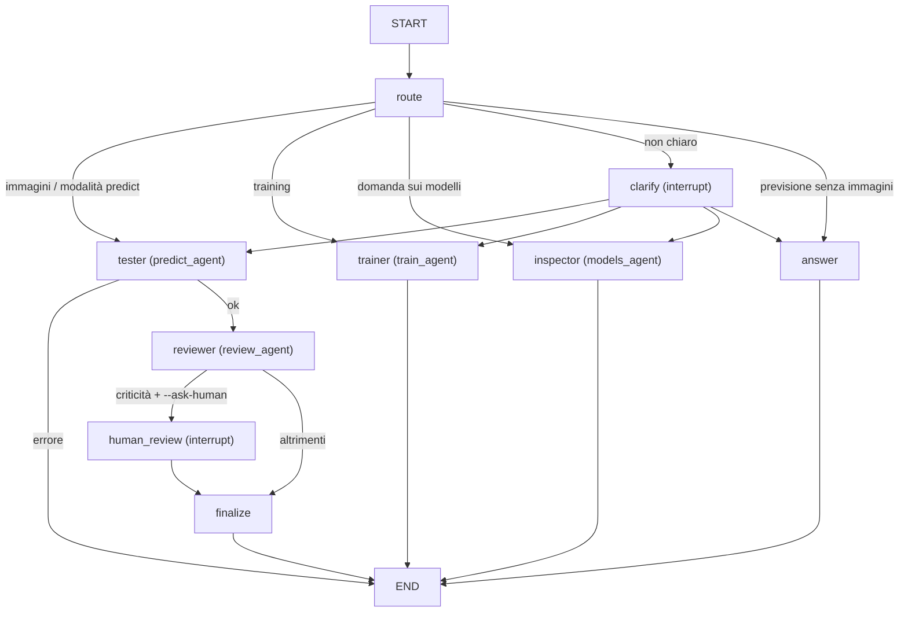

# `orchestrator/` + `review_agent/`: instradamento, previsione con revisione, training

L'orchestratore riceve la richiesta e la **instrada**:
- con immagini → **testing agent** (`predict_agent/`) e poi **reviewer agent**
  (`review_agent/`). Il reviewer legge tutto quello che ha fatto il tester (la
  stessa traccia che `-v` stampa a schermo, le decisioni, la memoria e i chunk
  della KB) e ne verifica la coerenza. Se trova contraddizioni le espone e, con
  `--ask-human`, ferma il grafo in attesa di una decisione umana. Se non ne
  trova, riassume la motivazione del tester per l'utente e spiega quale modello
  ha guidato la previsione e perché;
- con una richiesta di training → **training agent** (`train_agent/`, vedi il
  suo README), con le sue approvazioni umane;
- con una domanda sui modelli disponibili ("quali modelli ci sono?", "mostrami
  le ROC", "da cosa è composto il C-val?") → **models agent** (`models_agent/`,
  vedi il suo README): risposta dai fatti di validation, controllata in codice,
  di sola lettura.



**Come instrada `route`, senza liste di parole chiave:**
- modalità esplicita (`mode`, pulsante della UI) o immagini nella richiesta →
  decisione deterministica, esattamente come prima che il nodo esistesse. Il
  percorso di previsione non fa chiamate LLM in più ed è verificato identico;
- altrimenti un LLM legge la richiesta con output strutturato: intento
  (`predict` / `train` / `unclear`) e **solo** i vincoli di training dichiarati
  (architettura, numero di run, minuti, autonomia…). Con qwen3.6, "riconosci
  meglio il dermatofibroma, hai 20 minuti e usa una resnet" → `train`,
  `arch=resnet18`, `max_minutes=20`; "ciao, come stai?" → `unclear`;
- intento non chiaro, o nessun LLM → **chiede** (`interrupt` di tipo
  `clarify_intent`), non tira a indovinare.

Il training agent gira come sottografo compilato senza un proprio
checkpointer: eredita quello dell'orchestratore, e le sue interruzioni (piano,
proposte, promozione) arrivano all'orchestratore e riprendono con
`Command(resume=...)`. Ogni interruzione dichiara il suo `kind` e le sue
`options`.

I tre agenti sono grafi compilati indipendenti. Ognuno si può sostituire o
usare da solo.

## Uso

```bash
python -m orchestrator test_samples/05_melanoma.png
python -m orchestrator test_samples --no-llm                           # voto + controlli automatici, senza API key
python -m orchestrator test_samples --model ollama:qwen3.6 -v          # traccia live + racconto del processo
python -m orchestrator test_samples --reviewer-model claude-sonnet-5   # reviewer con un LLM diverso dal tester
python -m orchestrator test_samples --ask-human                        # pausa sulle criticità
python -m orchestrator --train "migliora il dermatofibroma, 30 minuti"  # instradato al training agent
python -m orchestrator --mode train --no-llm                           # training con la politica deterministica
python -m orchestrator test_samples --json                             # output strutturato
```

```python
from orchestrator import build_orchestrator
app = build_orchestrator(model="claude-sonnet-5", reviewer_model=None, verbose=1)
out = app.invoke({"image_paths": ["test_samples"]})
out["report"]                              # quello che legge l'utente
out["review_result"]["checks"]             # controlli automatici per immagine
out["review_result"]["decisive"]           # modello decisivo per immagine
out["test_result"]["trace"]                # la traccia del tester
```

Con `--ask-human` il grafo si ferma con `interrupt()`. Il chiamante mostra le
criticità e riprende con `app.invoke(Command(resume={"decision": ..., "note": ...}), config)`.
La CLI lo fa da sola e chiede *accetta / rifiuta / accetta con nota*. Senza un
umano alla tastiera (stdin chiuso) registra **rifiutato**, perché un'accettazione
non va mai data in silenzio.

## Cosa fa il reviewer

`gather → review → render`

1. **gather** (deterministico)
   - **retrieval indipendente**: cerca chunk per la classe finale e chunk
     trovati usando *la motivazione del tester come query*. Le affermazioni
     vengono così confrontate con letteratura che il tester non ha scelto.
   - **controlli automatici** (`review_agent/checks.py`): fatti calcolati in
     codice, che l'LLM non può contraddire.

     | Controllo | Gravità |
     | --- | --- |
     | la motivazione descrive l'immagine ("l'immagine mostra", "si osserva"...), ma il tester non la vede | critical |
     | melanoma e nevo sono le prime due classi con margine < 0.20 | critical |
     | override del voto da parte del tester | warning |
     | confidenza dichiarata più alta di quella del voto | warning |
     | confidenza bassa | warning |
     | chunk citati che non erano stati forniti | warning |
     | previsione passata diversa per la stessa immagine | warning |
     | LLM del tester fallito / override rifiutato | warning |
     | immagine ridimensionata (fuori distribuzione) | warning |
     | il modello più forte è cieco alla classe finale | info |
     | melanoma in gioco | info |
     | KB povera sulla classe finale | info |

   - **modello decisivo**: l'ensemble non sceglie un solo modello, quindi si
     calcola quale contribuisce di più al punteggio della classe finale (quota
     di `skill × p(classe)`). Si riportano anche la sua precision e recall di
     validazione su quella classe, come è stato addestrato, e se il modello più
     forte è d'accordo.
2. **review** (LLM, opzionale): riceve traccia, decisioni, controlli, modello
   decisivo e chunk indipendenti. Per ogni immagine restituisce:
   - un verdetto, `consistent` oppure `issues_found`;
   - le criticità nuove, con evidenza (numeri citati male, affermazioni
     contraddette dalla KB, override non giustificati...);
   - un riassunto per l'utente e la spiegazione del modello decisivo.

   Con `-v` scrive anche un racconto in linguaggio semplice di cosa ha fatto la
   pipeline. Non riclassifica mai le immagini, perché non le vede.
3. **render**: il testo finale. Un'immagine è marcata **⚠ CRITICITÀ** se c'è
   almeno un `warning` o un `critical`, dai controlli automatici o dall'LLM.
   In quel caso l'esito dice **RICHIEDE REVISIONE UMANA**.

Senza LLM (`--no-llm`), la revisione è fatta dai soli controlli automatici e da
riassunti a template.

## Verbose

`-v` stampa su stderr la traccia live del tester (come in `predict_agent`) e i
passi del reviewer: modello decisivo, chunk indipendenti, controlli, verdetti.
Inoltre fa scrivere al reviewer la sezione "Cosa è successo" nel report.
`-vv` aggiunge i payload JSON completi mandati ai due LLM.

La traccia del tester ora viene **sempre** raccolta nello stato (`trace`),
anche senza `-v`, perché il reviewer la legge in ogni caso.

## Log

| File | Chi scrive | Contenuto |
| --- | --- | --- |
| `runs_predict/predictions_log.jsonl` | tester | una riga per immagine: probabilità per modello, voto, decisione, motivazione |
| `runs_predict/reviews_log.jsonl` | orchestratore | una riga per esecuzione, legata dall'`execution_id`: controlli automatici, criticità del reviewer, verdetti, modello decisivo, racconto del processo, decisione umana |

## Verificato (2026-09-23)

- `--no-llm` su `test_samples/` (7 immagini): 4 segnalate per confidenza
  bassa. Il modello decisivo è `baseline_paper` in tutti i casi, anche
  sull'immagine 01, dove porta il 43% del punteggio della classe finale pur
  indicando un'altra classe (il report lo dice).
- `--model ollama:qwen3.6 -v --ask-human` su un'immagine: traccia completa,
  racconto del processo e riassunto in italiano, spiegazione corretta del
  modello decisivo. Il grafo si è fermato sul warning, ha ripreso con la
  decisione umana e l'ha salvata nel log.
- Limite osservato: qwen3.6 ha scritto `"warning"` come testo del campo
  `overall`. Un modello più capace (Claude) dovrebbe comportarsi meglio, ma
  non l'ho potuto provare perché manca la API key.
