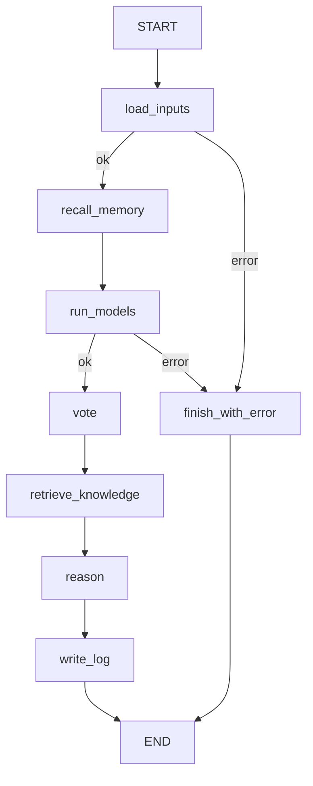

# `predict_agent/`: agente LangGraph di previsione, a ensemble

Prende in input una o più immagini (file e/o cartelle), le fa classificare da
**tutti i checkpoint FPViT locali**, combina le risposte con un **voto pesato**,
consulta la propria **memoria deterministica** (log delle esecuzioni precedenti)
e la **memoria stocastica** (retrieval su `corpus.json`), poi ragiona sul voto
e restituisce la previsione finale per immagine.

Pensato per stare dentro un sistema multi-agente: si aggiunge come **nodo** o
**subgraph** a un supervisor basato su `MessagesState`, oppure come **tool**.
Il codice esistente (`train.py`, `fpvit/`, `predict.py`, `simple_agent/`...)
non è stato modificato. Da `simple_agent` viene solo importato `build_llm`.

```
predict_agent/
  models.py   ModelZoo: trova ogni <run>/best_model.pt, legge le metriche di val
              salvate nel checkpoint, carica i modelli (cache), predice
  voting.py   soft vote, hard vote, modello più confident → decisione + livello di confidenza
  memory.py   ExecutionLog (JSONL, lookup esatto per SHA-256) e KnowledgeBase (TF-IDF)
  graph.py    il grafo LangGraph e il passo di ragionamento
  agent.py    build_predictor(), as_tool(), CLI
```

## Il grafo



| Nodo | Cosa fa | LLM? |
| --- | --- | --- |
| `load_inputs` | legge `image_paths`, oppure estrae i path dall'ultimo messaggio umano; calcola lo SHA-256 | no |
| `recall_memory` | **memoria deterministica**: previsioni passate per la stessa immagine (stesso hash) + statistiche del log | no |
| `run_models` | riscansiona i run (un training appena finito entra subito nell'ensemble) e fa girare ogni modello | no |
| `vote` | combina le previsioni (vedi sotto) | no |
| `retrieve_knowledge` | **memoria stocastica**: chunk del corpus sulle due classi in testa + uno sulla diagnosi differenziale | no |
| `reason` | l'LLM decide la classe finale, la confidenza e la spiegazione | **sì** (opzionale) |
| `write_log` | aggiunge una riga per immagine a `runs_predict/predictions_log.jsonl` | no |

Tutto ciò che stabilisce *cosa hanno detto i modelli* è deterministico: stessa
immagine e stessi checkpoint danno sempre lo stesso voto, con o senza LLM.

## Il voto

Ogni checkpoint porta con sé le metriche di validazione all'epoca selezionata,
incluse precision e recall per classe. Il voto le usa:

| Vista | Regola | Ruolo |
| --- | --- | --- |
| **soft vote** | media delle probabilità pesata per *skill* = balanced accuracy di val − 1/7 (sopra il caso) | decisione di default |
| **hard vote** | ogni modello vota la sua argmax, pesata con la sua **precision di val per quella classe** | controllo: un modello che spara sempre "nevo" conta poco quando dice "nevo" |
| **più confident** | il modello con la probabilità top più alta | riportato, mai decisivo da solo: un modello a 1 epoca collassato sulla classe 5 è molto sicuro e molto sbagliato |

**Confidenza**: `high` se le tre viste concordano, il margine top1−top2 è ≥ 0.25
e il soft vote è ≥ 0.5; `low` se soft e hard vote divergono o il margine è < 0.10;
altrimenti `medium`.

Per ogni classe si registrano anche i **modelli ciechi** (recall di val 0 su
quella classe). Ad esempio `baseline_paper` non riconosce mai il dermatofibroma,
mentre `dermamnist_3ep_adamw_inv` sì. Il loro dissenso su quella classe non è
un'evidenza contro.

**Override dell'LLM**: il passo `reason` può cambiare la classe, ma solo verso
una classe del *candidate set* (almeno 0.15 di probabilità nel soft vote,
oppure votata da almeno un modello). Una classe che nessun modello ha
sostenuto viene rifiutata dal codice e resta il voto. L'override viene
registrato sempre.

## Le due memorie

- **Deterministica**, `ExecutionLog`: un file JSONL append-only con una riga
  per immagine per esecuzione. Contiene le probabilità di ogni modello, il
  voto, la decisione finale, la motivazione e i checkpoint usati. Il richiamo
  è un lookup esatto per SHA-256, senza ranking. Serve a segnalare quando una
  nuova esecuzione contraddice una vecchia, di solito perché nel frattempo è
  entrato un nuovo checkpoint nell'ensemble.
- **Stocastica**, `KnowledgeBase`: TF-IDF (uni+bigrammi) sui 120 chunk di
  `corpus.json` (StatPearls/PubMed), con query espanse per classe (es.
  melanoma → "blue-white veil, atypical network, ..."). Il system prompt
  dichiara che questi chunk descrivono le condizioni, **non** l'immagine:
  l'LLM non vede le immagini e non deve dire di vederci una caratteristica.
  Per passare a embeddings densi basta sostituire `KnowledgeBase.search()`.

## Uso

```bash
pip install -r predict_agent/requirements.txt

python -m predict_agent.agent test_samples/05_melanoma.png test_samples/01_actinic_keratoses.png
python -m predict_agent.agent test_samples --no-llm            # solo voto, senza API key
python -m predict_agent.agent test_samples --model ollama:qwen3.6 --request "rispondi in italiano"
python -m predict_agent.agent test_samples --min-balanced-acc 0.4   # esclude i modelli deboli
python -m predict_agent.agent test_samples --json                    # output strutturato
```

### Verbose: traccia di ogni nodo

```bash
python -m predict_agent.agent test_samples -v     # ogni nodo: input, output, tempi, risposta completa dell'LLM
python -m predict_agent.agent test_samples -vv    # + il payload JSON completo inviato all'LLM
```

In Python si passa `build_predictor(..., verbose=1)`. Il tracer avvolge i nodi
stessi, quindi funziona anche quando l'agente gira come nodo o come tool di un
supervisor. Scrive su **stderr**, così `--json` su stdout resta pulito.

Per ogni nodo mostra:
- **input:** le immagini con hash e dimensioni;
- **memoria:** le previsioni passate trovate nel log;
- **modelli:** l'ensemble con skill e modelli ciechi, e il top-3 di ogni modello per immagine;
- **voto:** soft vote, hard vote, modello più confident, margine, candidati;
- **knowledge base:** i chunk recuperati, con punteggio e fonte;
- **LLM:** la risposta grezza prima della validazione (motivazione, chunk usati,
  prossimo passo, summary), gli override rifiutati dal codice e gli errori.

Una volta finito il run, anche lo stato restituito da `invoke()` contiene
`llm_input`, `llm_output`, `llm_error`, `rejected_overrides` ed `execution_id`.
Contiene anche `trace`: le righe che `-v` stampa, raccolte **sempre**, anche
senza verbose, perché il reviewer (`review_agent/`) le legge.

**Cosa resta su disco**: solo le righe di `predictions_log.jsonl` (una per
immagine). Ci sono probabilità per modello, voto, decisione finale e
motivazione; **non** ci sono il dettaglio del voto, i chunk recuperati e il
payload o la risposta grezza dell'LLM. Quelli si vedono solo con `-v` o nello
stato restituito.

L'LLM di default è `claude-sonnet-5` e serve `ANTHROPIC_API_KEY`. Le stringhe
`provider:modello` sono le stesse di `simple_agent`. Per Anthropic il thinking
è disattivato, perché l'output strutturato forza una tool call. Per Ollama la
finestra di contesto è portata a 32k token.

```python
from predict_agent import build_predictor
predictor = build_predictor(model="claude-sonnet-5")          # oppure model=None
out = predictor.invoke({"image_paths": ["test_samples"], "request": ""})
out["final"]    # lista strutturata, una voce per immagine
out["report"]   # testo
```

## Multi-agente

**Come nodo o subgraph** di un supervisor: lo stato ha il canale `messages`
con il reducer `add_messages`, quindi si innesta direttamente in un grafo
`MessagesState`. Legge i path dall'ultimo messaggio umano (tra virgolette se
contengono spazi) e risponde con un `AIMessage` chiamato `derma_predictor`.

```python
from langgraph.graph import StateGraph, MessagesState, START
from predict_agent import build_predictor

g = StateGraph(MessagesState)
g.add_node("derma_predictor", build_predictor(model=None))
g.add_edge(START, "derma_predictor")
...
```

**Come tool** per un supervisor ReAct (ad esempio `create_react_agent` o
`langgraph-supervisor`):

```python
from predict_agent import as_tool
tool = as_tool(model="claude-sonnet-5")    # nome: derma_predictor
# args: image_paths: list[str], request: str = ""
# ritorna {"predictions": [...], "report": "..."} oppure {"error": "..."}
```

## Verificato (2026-09-23, macOS, MPS)

- Deterministico su `test_samples/`: 4/7 corrette (AK, BCC, BKL e nevo;
  sbagliate dermatofibroma, melanoma e lesione vascolare). Gli errori vengono
  dai modelli, non dal voto: anche `baseline_paper` sbaglia 04 e 07.
- Il richiamo dalla memoria funziona: alla seconda esecuzione la stessa
  immagine mostra "previously (...)".
- Il passo `reason` con `ollama:qwen3.6` su 2 immagini dà un output
  strutturato valido e motivazioni in italiano coerenti con il voto, in circa
  4 minuti in locale.
- Verificati sia l'inserimento come nodo in un grafo `MessagesState` sia l'uso
  come tool, compreso il messaggio d'errore per un path inesistente.

## Limiti

- **L'ensemble è debole quanto i suoi modelli.** Oggi sono 4 checkpoint: 3
  hanno 1–2 epoche (balanced accuracy di val 0.24–0.48) e solo
  `baseline_paper` è un run vero (0.53). Il peso per skill li ridimensiona,
  ma un ensemble utile richiede checkpoint migliori. `--min-balanced-acc`
  permette di escludere quelli deboli.
- I pesi sono presi dalle metriche di **validazione**, la stessa split usata
  per selezionare l'epoca, quindi sono un po' ottimistici. Sul test split
  non si tocca nulla.
- I modelli lavorano a 28×28. Un'immagine più grande viene ridimensionata e
  il report avvisa che è fuori distribuzione.
- Nel tool, i path relativi si risolvono rispetto alla directory corrente.
