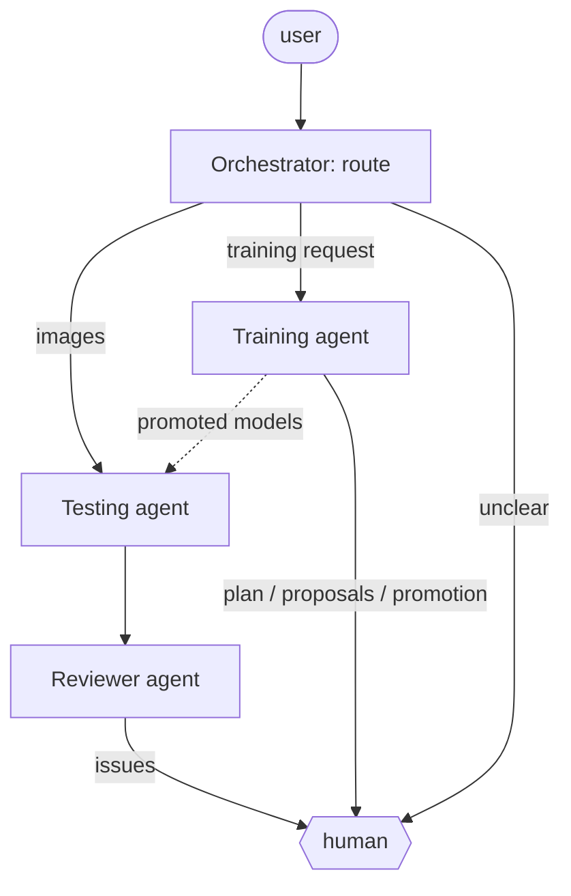
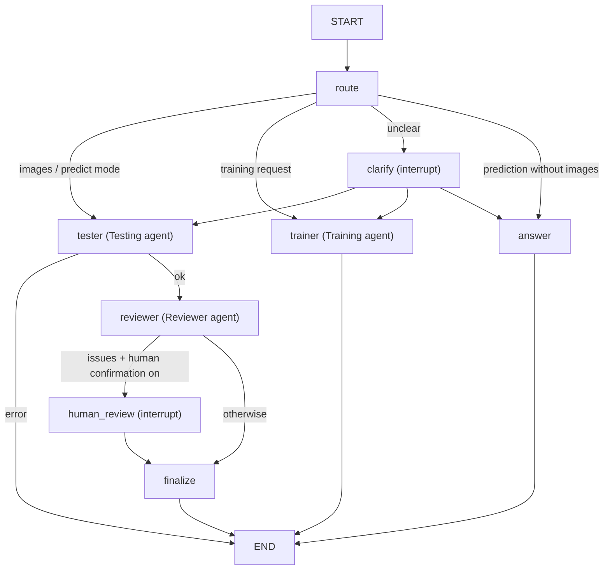
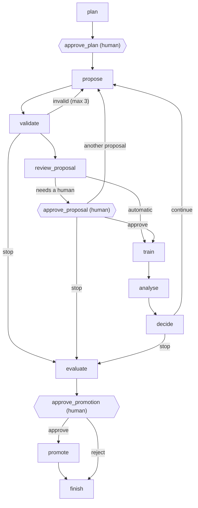

<strong>PROJECT PROPOSAL</strong>

<h1 align="center">AgenticDerma</h1>

<h3 align="center">Human-Supervised Multi-Agent Deep Learning for Dermatological Image Classification and Explainability</h3>

---

| Project purpose |
| --- |
| Build and verify a human-supervised multi-agent system for DermaMNIST classification, model training and promotion, prediction review, enrichment, and explanation. |

| Project item | Definition |
| --- | --- |
| **Dataset** | DermaMNIST, MedMNIST v2; lesion-level corrected releases DermaMNIST-C and DermaMNIST-E |
| **Technical focus** | Seven-class dermoscopic image classification with a validated model ensemble, reproducible evaluation, and explainable, reviewed output |
| **Software** | DermaAgent: LangGraph agents, PyTorch classifiers, and a local web platform |
| **Team roles** | Project Manager \| Technical Responsible \| Reviewer |

---

## Table of Contents

| Section |
| --- |
| [1. Project Team](#1-project-team) |
| [2. Project Definition](#2-project-definition) |
| &nbsp;&nbsp;[2.1 Abstract](#21-abstract) |
| &nbsp;&nbsp;[2.2 Problem](#22-problem) |
| &nbsp;&nbsp;[2.3 Project Scope](#23-project-scope) |
| &nbsp;&nbsp;[2.4 Objectives and Research Questions](#24-objectives-and-research-questions) |
| [3. State of the Art](#3-state-of-the-art) |
| [4. Technical Approach](#4-technical-approach) |
| &nbsp;&nbsp;[4.1 System Design](#41-system-design) |
| &nbsp;&nbsp;[4.2 Architecture](#42-architecture) |
| &nbsp;&nbsp;[4.3 Data and Models](#43-data-and-models) |
| &nbsp;&nbsp;[4.4 Evaluation](#44-evaluation) |
| &nbsp;&nbsp;[4.5 Explanation and Enrichment](#45-explanation-and-enrichment) |
| [5. Work Plan](#5-work-plan) |
| &nbsp;&nbsp;[5.1 WP1 - Research and Requirements](#51-wp1---research-and-requirements) |
| &nbsp;&nbsp;[5.2 WP2 - Data](#52-wp2---data) |
| &nbsp;&nbsp;[5.3 WP3 - Training](#53-wp3---training) |
| &nbsp;&nbsp;[5.4 WP4 - Evaluation](#54-wp4---evaluation) |
| &nbsp;&nbsp;[5.5 WP5 - Enrichment and XAI](#55-wp5---enrichment-and-xai) |
| &nbsp;&nbsp;[5.6 WP6 - Testing](#56-wp6---testing) |
| &nbsp;&nbsp;[5.7 WP7 - Output](#57-wp7---output) |
| &nbsp;&nbsp;[5.8 WP8 - Review](#58-wp8---review) |
| [6. Gantt Table](#6-gantt-table) |
| [7. Development and Feasibility](#7-development-and-feasibility) |
| [8. Expected Results](#8-expected-results) |
| [9. Risks](#9-risks) |
| [10. Project Value](#10-project-value) |
| [11. Final Verification](#11-final-verification) |
| [12. References](#12-references) |

---

## 1. Project Team

The project uses three roles. The Project Manager coordinates scope, work packages, risks, and deliverable integration. The Technical Responsible owns the system design and implementation. The Reviewer checks requirements, results, KPIs, and final acceptance. The same three people act as the human in the loop of the running system: they approve training plans and promotions and decide on the issues the agents escalate.

| Team | Role | Responsibility |
| --- | --- | --- |
| **Emanuele DAMIANO** | **Project Manager** | Coordinates scope, work packages, interfaces, risks, and final deliverables. Maintains the requirement-to-deliverable matrix and resolves work-package dependencies. |
| **Flavia FORTE** | **Technical Responsible** | Implements the data pipeline, classifiers, agents and their tools, experiment tracking, evaluation functions, XAI, the web platform, integration, and reproducibility controls. |
| **Abdelkader MESSLEM** | **Reviewer** | Defines verification evidence, audits data and test isolation, checks KPIs against logged results, reviews explanation grounding and agent escalations, records findings, and issues final acceptance. |

## 2. Project Definition

### 2.1 Abstract

DermaMNIST provides a compact benchmark for seven-class dermoscopic image classification, but reliable results depend on data integrity, class-balanced evaluation, reproducibility, and clear separation between model evidence and generated explanation. This project develops an end-to-end multi-agent system in which an Orchestrator routes each request to specialized LangGraph agents: a Testing Agent that classifies images with a validated model ensemble, a Reviewer Agent that audits every prediction, and a Training Agent that plans, runs, and proposes new models. The system follows one rule throughout: numbers come from code, language comes from the LLM. Deterministic functions compute data processing, classifier inference, ensemble votes, metrics, training diagnoses, and promotion scores before any language model writes text, and deterministic checks reject claims the evidence does not support. A human stays in the loop at every decision that should not be taken silently: training plans, out-of-policy training runs, model promotion, and review findings. New models join the ensemble only when they improve it on validation data and a human approves. Medical context is retrieved only after the vote and is linked to cited sources. The final system is evaluated through split-integrity checks, macro and per-class metrics, calibration, isolated and external testing, grounding checks, and independent review, producing a traceable DermaMNIST research prototype.

### 2.2 Problem

A DermaMNIST model can report a strong test score while still being affected by duplicate images, split leakage, class imbalance, or weak minority-class performance. Generated explanations add a separate risk when they are not tied to classifier evidence or external sources, and an agent that trains and deploys models on its own adds a third: a model can reach the prediction system without anyone having checked that it improves it. The project addresses the engineering problem of automating the full workflow while keeping data, prediction, metrics, model promotion, and review evidence under explicit control of code and of a human.

### 2.3 Project Scope

- **Dataset:** DermaMNIST, using the seven lesion classes derived from HAM10000 [18]. The official split is kept for benchmark comparison and is the split the agents use today. The lesion-level corrected release DermaMNIST-C [2] is the leakage-aware split for training and selection at 28 and 224 px. The DermaMNIST-E test split, built from the ISIC 2018 challenge [19] and therefore outside DermaMNIST, is used only as an external test.
- **Task:** supervised multi-class image classification with fixed train, validation, and test handling.
- **Multi-agent system:** Orchestrator, Testing Agent, Reviewer Agent, and Training Agent, each a compiled LangGraph graph, with a human in the loop through graph interrupts and a local web platform as the user interface. Evaluation, enrichment, and explanation are tools and nodes inside these agents (Section 4.1).
- **Classifiers:** a Feature Pyramid Vision Transformer (FPViT) [17] and three compact CNN families (ResNet-18, EfficientNet-B0, ConvNeXt-Tiny), combined in a skill-weighted ensemble.
- **Explainability:** an evidence-level explanation of every prediction (ensemble vote, decisive model, cited sources, reviewer checks, full LLM context), and a visual attribution map from the classifiers.
- **Output:** predicted class, ensemble class probabilities, confidence level as the uncertainty flag, decisive model, cited class information, reviewer verdict and findings, attribution, and execution (trace) ID.
- **Excluded:** clinical diagnosis, treatment advice, hospital deployment, private patient data, agent access to the test split, and agent-driven changes to the final test protocol.

MedMNIST defines the benchmark for research and education and does not position the reduced-resolution images for clinical use [1]. The project therefore evaluates a research prototype.

### 2.4 Objectives and Research Questions

| ID | Objective | Expected result |
| --- | --- | --- |
| **O1** | Verify the data basis | Reproduce DermaMNIST, document duplicates and leakage, adopt a lesion-level corrected split, record class distribution, and fix the data policy before training. |
| **O2** | Build the classifier ensemble | Compare FPViT and a small set of compact CNN families under one protocol, and admit a model to the ensemble only on validation evidence and human approval. |
| **O3** | Build the multi-agent workflow | Give each agent a defined task, tool set, input schema, output schema, permission boundary, and human-approval points. |
| **O4** | Verify prediction and explanation | Use fixed metrics, isolated and external testing, calibration, XAI, source-grounded enrichment, deterministic review checks, and traceable outputs. |
| **O5** | Deliver and review the prototype | Run the complete system from the web platform and close the project with Reviewer-owned acceptance evidence. |

The project is guided by three research questions:

- **RQ1.** Can specialized agents coordinate DermaMNIST experiments while preserving reproducibility, test isolation, complete action logs, and human control over the decisions that matter?
- **RQ2.** Which classification strategy is strongest when selection uses class-balanced validation metrics and leakage-aware data: single models or a skill-weighted ensemble, 28 px or 224 px, training from scratch or from an ImageNet-pretrained extractor?
- **RQ3.** Can the system add useful lesion information and visual evidence while keeping every change to the ensemble decision bounded by model evidence, logged, and reviewed?

## 3. State of the Art

MedMNIST v2 provides standardized biomedical classification datasets and defines DermaMNIST as a 10,015-image, seven-class dermoscopy benchmark at 28 × 28 RGB resolution [1], derived from HAM10000 [18]. Its compact format supports reproducible experiments, but dataset quality must be checked before interpreting benchmark scores. Abhishek, Jain, and Hamarneh found duplicate images, cross-split leakage, and labeling problems in DermaMNIST and HAM10000, showed that these issues can change measured performance, and released corrected versions of the dataset: DermaMNIST-C, with lesion-level splits, and DermaMNIST-E, which trains on all of HAM10000 and tests on the ISIC 2018 challenge images [2], [19]. Li et al. address the same problem from a documentation perspective by proposing a dermatology dataset nutrition label that records provenance, metadata, limitations, and risks [9]. These studies make dataset identity, split integrity, and preprocessing records part of the evidence required for model evaluation.

Recent skin-lesion work also shows that model quality cannot be reduced to one accuracy value. Dakhli and Barhoumi integrated saliency information into the loss function and evaluated classification together with explanation behavior on HAM10000 and PH2 [5]. Zuo, Wang, and Wang combined clinical images, dermoscopy, and metadata through adaptive fusion and used uncertainty to control how modalities contribute to the final result [6]. DermaMNIST is image-only, so the same multimodal design cannot be transferred directly, but the evaluation lesson is relevant: class balance, uncertainty, and per-class errors need to be visible when models are compared. On the MedMNIST benchmark itself, Liu et al. proposed the Feature Pyramid Vision Transformer, which attaches shallow transformer heads to several stages of a ResNet-18 extractor and fuses them for classification [17]. It is designed for small inputs and is the project's reference transformer model.

Larger dermatology systems show what changes when scale and clinical context increase. Yan et al. introduced PanDerm, a foundation model trained on more than two million images from multiple institutions and imaging modalities, and reported gains across a broad set of dermatology tasks [3]. Nahm et al. reviewed approved dermatology AI applications and found that clinical use depends on validation, workflow fit, and implementation requirements in addition to model performance [7]. Han et al. evaluated a skin-disease system using large hospital and worldwide usage data, showing how prevalence and out-of-distribution inputs change real-world performance [8]. Prospective evidence remains more limited: Laiouar-Pedari et al. found comparable pooled melanoma performance between AI and dermatologists across 11 prospective studies but also reported heterogeneity and risk of bias [12], while Anriot et al. showed that expert dermatologists still outperformed current AI models in a realistic multiclass setting [13]. These results support careful benchmark claims and separate research validation from clinical readiness.

Explainability is most useful when it can be evaluated as part of the decision process. Chanda et al. studied 76 dermatologists with eye tracking and found that a dermatologist-oriented XAI interface improved balanced melanoma accuracy compared with standard AI support [4]. The result supports explanation as a measurable system output rather than a visual add-on. For DermaMNIST, the 28 × 28 input limits fine spatial interpretation, so attribution should be treated as coarse model evidence and kept separate from medical facts retrieved from external sources. Gradient-weighted class activation mapping [20] and post-hoc temperature scaling [21] are established, low-cost methods for attribution and calibration respectively.

Agent-based medical AI is moving from single prompts toward systems that call tools and divide work across roles. Ferber et al. connected an autonomous oncology agent to specialist models, retrieval, and other tools and showed that tool orchestration can improve task performance over the base language model [10]. Chen et al. reported that a multi-agent conversation framework improved diagnostic reasoning over single-model baselines on rare-disease cases [11]. Reviews by Collaco et al. and Yu et al. show that healthcare agents are still mainly prototypes and that safety, evaluation, and real-world validation remain uneven [14], [15]. AgentClinic reaches the same conclusion from benchmarking: tool-using clinical agents face larger errors when tasks require sequential actions and interaction with external tools [16]. This evidence supports specialized agents with fixed tools, logged actions, deterministic checks at the points where numerical results or acceptance decisions are produced, and a human at the decisions that cannot be verified by code alone.

The literature leaves a practical gap at the system level. Data quality, model selection, multi-agent coordination, explainability, human oversight, and independent verification are often studied separately. A compact DermaMNIST project can examine how these controls work together in one reproducible pipeline.

## 4. Technical Approach

### 4.1 System Design

The system uses specialized agents built as LangGraph graphs, connected through typed graph state, versioned records on disk, and fixed tool interfaces. Each agent receives only the inputs needed for its task. Deterministic code performs data transforms, training execution, classifier inference, ensemble voting, metric computation, training diagnosis, promotion scoring, review checks, and XAI generation. Language models read the request, plan, propose, interpret structured results, and write explanations. Without a language model, prediction, review, and training still run, and deterministic rules take its place.

| Agent | Task | Main inputs | Output |
| --- | --- | --- | --- |
| **Orchestrator** | Route each request and surface the other agents' interrupts to the human | User request, images, platform settings | Route (predict, train, clarify), final report, review log entry |
| **Testing Agent** | Classify one or more images with every model of the ensemble and decide the final class | Images, ensemble checkpoints with their validation metrics, execution log, clinical knowledge base | Per-image vote, final class, confidence, cited rationale, execution ID |
| **Reviewer Agent** | Check the Testing Agent's full trace for consistency with the evidence | Tester trace and decisions, independent retrieval, deterministic checks | Per-image verdict, findings with severity, decisive model, summary for the user |
| **Training Agent** | Plan a training campaign, propose and run each training segment, diagnose curves, and propose promotion | Request and constraints, past runs and campaigns, ensemble state, training knowledge base | Campaign record, run checkpoints, promotion evaluation, promoted model |
| **Human (Reviewer role)** | Approve or reject the decisions the agents must not take alone | Interrupt payloads: plan, proposal, promotion, review findings, unclear intent | Decision and note, stored in the logs |

The six functional roles of the original design are all covered, but four of them run as nodes or tools inside the agents above rather than as separate agents:

| Functional role | Implementation |
| --- | --- |
| Training | Training Agent (`train_agent/`) |
| Evaluation and selection | Promotion gate of the Training Agent (`promotion.py`): the ensemble is scored with and without the candidate on validation data; `fpvit/engine.evaluate()` computes the metrics |
| Enrichment | Retrieval node of the Testing Agent, plus an independent retrieval in the Reviewer Agent |
| Explanation | Reasoning node of the Testing Agent, plus the Reviewer Agent's summary and decisive-model explanation |
| Isolated testing | `evaluate_test.py`, a separate manual function that only loads the test split, run once on the frozen package (WP6) |
| Review | Reviewer Agent for every prediction, training reviewer for every training proposal, human Reviewer for project acceptance |

Permission boundaries are enforced in code:

- The Training Agent and the promotion gate read only the validation arrays of the dataset. The test split is never loaded by any agent.
- A training proposal is validated in code (bounds, optimizer-specific learning rates, admissible augmentation, no repeated configuration) before it can run. An autonomy gate (supervised, guarded by default, autonomous) decides which proposals need a human. The plan and every promotion always need one.
- Models are never overwritten. Each run writes to a new folder, and promotion copies the checkpoint under a new name into `models_promoted/`, the only folder of new models the Testing Agent reads.
- The Testing Agent's language model can change the voted class only to a class the ensemble supports (at least 0.15 soft-vote probability, or voted by at least one model). Any other override is rejected by code. Every override is logged and raised by the Reviewer Agent as a warning.
- The Reviewer Agent cannot reclassify an image and cannot contradict the deterministic checks. With no human available, an escalated decision is recorded as rejected, never as accepted.

### 4.2 Architecture

The four agents are independent compiled graphs; each can also run on its own from the command line. The Orchestrator runs the others as subgraphs, and their `interrupt()` calls reach the human through the Orchestrator and resume with the human's decision.

*Figure 1. General process graph of the multi-agent system (LangGraph).*

At node level, the Orchestrator routes deterministically when the request carries images or an explicit mode, and otherwise reads the request with a structured-output LLM (intent plus training constraints). When the intent is unclear it asks instead of guessing.

*Figure 2. Orchestrator graph with the Testing, Reviewer, and Training Agents as subgraphs.*

The Testing Agent runs `load_inputs → recall_memory → run_models → vote → retrieve_knowledge → reason → write_log`, and the Reviewer Agent runs `gather → review → render`. The Training Agent is the only agent that loops, and it contains the human approval points of the training workflow:

*Figure 3. Training Agent graph. Plan and promotion are always approved by a human; proposals are approved according to the autonomy level.*

The web platform runs the Orchestrator and streams the start and result of every node, including the nodes of the subgraphs. It shows the agent graph live, the communication trace, training curves per epoch, and a single human-decision dialog for every kind of interrupt.

### 4.3 Data and Models

The data pipeline loads DermaMNIST through the `medmnist` package and the corrected releases from Zenodo with MD5 verification. It records labels, split membership, image size, normalization, and class counts in every experiment record.

| Dataset | Split | Train / val / test | Resolutions | Use |
| --- | --- | --- | --- | --- |
| DermaMNIST | official, image-level | 7,007 / 1,003 / 2,005 | 28 (64/128/224 via MedMNIST+, same split) | benchmark comparison; the split the agents and the promotion gate use today |
| DermaMNIST-C | lesion-level corrected [2] | 8,215 / 573 / 1,227 | 28, 224 | leakage-aware training, selection, and final test |
| DermaMNIST-E | train = all HAM10000, val/test = ISIC 2018 | 10,015 / 193 / 1,511 | 28, 224 | external test only, for models trained on DermaMNIST-C |

At 224 px, images are resized directly from the originals, not upscaled from 28 px. The E training split contains every validation and test image of C, so a model trained on E is never tested on C.

The training split is strongly imbalanced (class counts 228, 359, 769, 80, 779, 4,693, 99): melanocytic nevi account for 67 % of the images, dermatofibroma and vascular lesions for about 1 % each. Class-weighted loss (inverse frequency or effective number of samples [22]) and balanced sampling are the controlled imbalance factors. They are alternatives, and the weights apply to the training loss only, so validation loss stays comparable across runs. Augmentation is applied only to training data and is restricted by the dermoscopy modality: the dihedral group (flips and 90° rotations) is always admissible, hue jitter is capped because colour is diagnostic, and no operation fills borders with black, which would imitate dermatoscope vignetting. The resolved augmentation is stored field by field with every run.

Model comparison covers FPViT [17] and the MedMNIST ResNet-18 reference family [1], plus EfficientNet-B0 and ConvNeXt-Tiny, all adapted to 28 × 28 inputs. FPViT also runs at 224 px, with an ImageNet stem and patch-embedded transformer heads. At that resolution, training from scratch is compared with starting from an ImageNet-pretrained extractor as an ablation over three seeds. The pretrained weights contain no dermatology data and therefore no leakage. All candidates share the same data policy, seed policy, validation metrics, and experiment logging.

The Testing Agent combines every available checkpoint instead of relying on one model:

| View | Rule | Role |
| --- | --- | --- |
| Soft vote | probabilities averaged with weight = validation balanced accuracy − 1/7 (skill above chance) | default decision |
| Hard vote | each model's argmax, weighted by its validation precision for that class | check against majority-class bias |
| Most confident model | highest top-1 probability | reported, never decisive on its own |

A new model enters the ensemble only through the promotion gate (Section 4.4) and a human approval. One model ships with the repository, `baseline_paper` (FPViT with the reference hyperparameters, validation balanced accuracy 0.533), so a fresh clone runs the whole system.

### 4.4 Evaluation

The evaluator reports accuracy for benchmark comparison and uses macro-F1, balanced accuracy, macro one-vs-rest AUROC, per-class precision, recall and F1, and the confusion matrix for model assessment. Plain accuracy is never a selection metric: predicting the majority class alone reaches 0.67. A training campaign selects checkpoints on balanced accuracy, macro-F1, or macro-AUROC, fixed in the plan the human approves.

Promotion is decided on validation data only. The promotion gate scores the soft-vote ensemble with and without the candidate on the validation split, and reports the change in balanced accuracy and in per-class recall. A gain below 0.005 is treated as validation noise. Because the vote weights and the evaluation both come from the validation split, absolute numbers are optimistic, but the with/without comparison is fair. The gate currently compares only 28 px models of the official split, so that every member is scored on the same validation set. Admitting DermaMNIST-C and 224 px models requires moving the ensemble validation to C-val.

The uncertainty rule is deterministic and fixed. Confidence is high when the three views agree, the top-1 minus top-2 margin is at least 0.25, and the soft vote is at least 0.5. It is low when the soft and hard votes disagree or the margin is below 0.10, and medium otherwise. Calibration of the ensemble probabilities (expected calibration error and reliability diagrams, with temperature scaling fitted on validation data [21]) is added in WP4 and fixed before final testing.

Before final testing, the ensemble is frozen in a manifest that lists every member with its checkpoint SHA-256, vote weight, data-split ID, preprocessing settings, and code commit. Final test labels are available only inside the isolated test function, which loads the test split alone, at the model's own input size and normalization, and writes a test report next to the checkpoint. The same function evaluates a DermaMNIST-C model on the DermaMNIST-E test split as an external test.

### 4.5 Explanation and Enrichment

The ensemble produces the vote and the probability vector. The Testing Agent then retrieves class information from a curated knowledge base of 120 passages from StatPearls and PubMed (TF-IDF over unigrams and bigrams, with class-specific query expansion) for the two leading classes and their differential diagnosis. A language model combines the vote, the execution memory (past predictions of the same image, found by SHA-256), and the retrieved passages into the final decision and rationale. The language model never sees the image: the knowledge base describes conditions, not the image. A rationale that claims to see an image feature is flagged as a critical finding.

The Reviewer Agent checks the rationale against an independent retrieval, using the tester's own rationale as the query, and against deterministic checks:

| Check | Severity |
| --- | --- |
| rationale describes the image, which the tester cannot see | critical |
| melanoma and nevus are the top two classes with margin < 0.20 | critical |
| the tester overrode the vote | warning |
| stated confidence higher than the vote's | warning |
| low confidence | warning |
| cited passages that were not provided | warning |
| past prediction for the same image differs | warning |
| tester LLM failed, or an override was rejected | warning |
| image resized (out of distribution) | warning |
| strongest model is blind to the final class | info |
| melanoma in play | info |
| knowledge base thin on the final class | info |

The Reviewer Agent also identifies the decisive model, the member that contributes most to the final class's score, and explains it to the user. Any warning or critical finding marks the image for human review. The explanation records which information came from the models, the vote, the retrieved sources, and the language model. The web platform exposes the full context each language model received and the knowledge base itself.

The XAI module adds a visual attribution map from the frozen ensemble members, for example Grad-CAM [20] on the CNNs and on the extractor stages of FPViT. It is linked to the same execution ID as the prediction. At 28 × 28 the map is coarse model evidence and is kept separate from retrieved medical facts. The 224 px models give a finer map.

## 5. Work Plan

Each work package produces a deliverable with a defined verification check. Outputs become inputs to later work packages only after acceptance.

### 5.1 WP1 - Research and Requirements

WP1 defines the technical requirements, acceptance rules, and feasibility baseline.

| Activity line | Activity | Responsible | Deliverable | KPI / verification |
| --- | --- | --- | --- | --- |
| LA1.1 | State of the art | Reviewer | D1.1 Research review | All cited papers are discussed and each major finding is linked to a requirement or design choice. |
| LA1.2 | Requirements | Project Manager | D1.2 Requirements matrix | Every mandatory requirement has an owner, verification method, and linked deliverable. |
| LA1.3 | Feasibility baseline | Technical Responsible | D1.3 Technical baseline | Dataset policy, model scope, agent interfaces, human-approval points, metrics, and test rules are defined before implementation. |

### 5.2 WP2 - Data

WP2 produces the versioned dataset files used by training and evaluation.

| Activity line | Activity | Responsible | Deliverable | KPI / verification |
| --- | --- | --- | --- | --- |
| LA2.1 | Dataset registry | Technical Responsible | D2.1 Dataset registry | Official DermaMNIST and DermaMNIST-C/E: image counts, seven labels, partitions, image dimensions, class counts, and checksums are verified. |
| LA2.2 | Integrity audit | Reviewer | D2.2 Audit report | The leakage of the official split is documented from [2]; the lesion-level DermaMNIST-C split and the C-train / C-test / E-test protocol are approved as the leakage-aware policy. |
| LA2.3 | Data preparation | Technical Responsible | D2.3 Preprocessing pipeline | A clean run recreates the same splits, normalization, resolution, augmentation policy, and loaders from versioned settings. |

### 5.3 WP3 - Training

WP3 defines the experiment space and automates training through the Training Agent.

| Activity line | Activity | Responsible | Deliverable | KPI / verification |
| --- | --- | --- | --- | --- |
| LA3.1 | Model methods | Technical Responsible | D3.1 Experiment protocol | FPViT, ResNet-18, EfficientNet-B0, and ConvNeXt-Tiny are compared under the same preprocessing, seed policy, and validation metrics; the 224 px scratch-versus-pretrained ablation runs over three seeds. |
| LA3.2 | Training Agent | Technical Responsible | D3.2 Training Agent specification | Proposals are validated in code; the autonomy gate and the training reviewer decide which proposals need a human; plan and promotion are always approved; all actions and parameters are logged; test data are unavailable. |
| LA3.3 | Automated training | Technical Responsible | D3.3 Model set and experiment registry | Each completed run can be reproduced from its stored configuration; every run has an explicit stop reason; no run overwrites an existing folder or model. |

### 5.4 WP4 - Evaluation

WP4 evaluates candidate models, controls their entry into the ensemble, and freezes the ensemble before final testing.

| Activity line | Activity | Responsible | Deliverable | KPI / verification |
| --- | --- | --- | --- | --- |
| LA4.1 | Metric policy | Reviewer | D4.1 Evaluation specification | Primary metrics, promotion threshold, calibration method, and confidence rule are fixed before model selection. |
| LA4.2 | Promotion gate | Technical Responsible | D4.2 Promotion gate and registry | The gate calls only fixed validation functions, compares the ensemble with and without the candidate, and records the evaluation, the human decision, and the checkpoint SHA-256 in the promotion registry. |
| LA4.3 | Ensemble freeze | Reviewer | D4.3 Frozen ensemble package | Selection uses validation evidence only; member checksums, vote weights, preprocessing settings, code version, and selection record are stored in a manifest. |

### 5.5 WP5 - Enrichment and XAI

WP5 adds sourced lesion information and model attribution after the classifier interface is stable.

| Activity line | Activity | Responsible | Deliverable | KPI / verification |
| --- | --- | --- | --- | --- |
| LA5.1 | Source and explanation policy | Reviewer | D5.1 Source policy and output schema | Approved source types, required citation fields, unsupported-claim behavior, override limits, and evidence fields are defined. |
| LA5.2 | Knowledge retrieval | Technical Responsible | D5.2 Retrieval and knowledge base | Retrieved passages are linked to approved sources; retrieval has no tool for changing classifier outputs; the Reviewer Agent retrieves independently. |
| LA5.3 | XAI integration | Technical Responsible | D5.3 XAI module | Each attribution is generated from the frozen ensemble members and linked to the same execution ID as the prediction. |

### 5.6 WP6 - Testing

WP6 tests the frozen ensemble and integrated modules under the fixed test protocol.

| Activity line | Activity | Responsible | Deliverable | KPI / verification |
| --- | --- | --- | --- | --- |
| LA6.1 | Isolated test function | Technical Responsible | D6.1 Test function specification | The test function loads only the test split, runs only on the frozen package, and cannot change the models, preprocessing, or metric code. |
| LA6.2 | Test protocol | Reviewer | D6.2 Test specification | Test sets (official, C-test, E-test as external), mandatory metrics, failure rules, and output format are fixed before execution. |
| LA6.3 | System test | Reviewer | D6.3 Final test report | All required metrics, per-class results, calibration, external-test results, and failure cases are recorded without post-test tuning. |

### 5.7 WP7 - Output

WP7 combines accepted prediction, review, XAI, enrichment, and trace information into the final interface.

| Activity line | Activity | Responsible | Deliverable | KPI / verification |
| --- | --- | --- | --- | --- |
| LA7.1 | Explanation step | Technical Responsible | D7.1 Explanation specification | The reasoning step receives only the vote, memory, and cited passages; any override stays within the candidate set, is logged, and is flagged for review. |
| LA7.2 | Output format | Project Manager | D7.2 Case report | The report contains prediction, probabilities, confidence, decisive model, reviewer verdict, attribution, citations, and execution ID. |
| LA7.3 | Prototype run | Project Manager | D7.3 Prototype package | An unseen benchmark case runs from upload on the web platform to report without manual editing of intermediate results. |

### 5.8 WP8 - Review

WP8 checks every prediction and the complete evidence package, and closes final findings.

| Activity line | Activity | Responsible | Deliverable | KPI / verification |
| --- | --- | --- | --- | --- |
| LA8.1 | Reviewer Agent and review checklist | Reviewer | D8.1 Review checklist | The Reviewer Agent runs its deterministic checks on every prediction and escalates findings to the human; the checklist covers expected records, KPI evidence, version links, and conflicts, and records each finding. |
| LA8.2 | Final assessment | Reviewer | D8.2 Acceptance report | No critical finding remains open; accepted limitations include their technical consequence. |

## 6. Gantt Table

The table shows the work-package sequence, required inputs, work that can progress in parallel, and the gate that closes each package.

| Work package | M1 W1 | M1 W2 | M1 W3 | M1 W4 | M2 W5 | M2 W6 | M2 W7 | M2 W8 | M3 W9 | M3 W10 | Completion gate |
| --- | :-: | :-: | :-: | :-: | :-: | :-: | :-: | :-: | :-: | :-: | --- |
| **WP1** Research & requirements | X | | | | | | | | | | Requirements approved |
| **WP2** Data | | X | X | | | | | | | | Data package accepted |
| **WP3** Training | | | X | X | X | | | | | | Candidate models logged |
| **WP4** Evaluation | | | | | X | X | | | | | Frozen ensemble accepted |
| **WP5** Enrichment & XAI | | X | X | X | X | X | | | | | Enrichment & XAI verified |
| **WP6** Testing | | | | | | | X | X | | | Test report accepted |
| **WP7** Output | | | | | | | | X | X | | Prototype demo passed |
| **WP8** Review | | | | | | | | | X | X | Critical findings closed |

## 7. Development and Feasibility

### 7.1 Development Method

The project uses Agile iteration inside each work package. Accepted outputs act as stage gates: data package, metric policy, frozen ensemble, test report, and final review. A change to an accepted upstream output requires the affected downstream checks to run again. This keeps experiments flexible while preserving the evidence used for acceptance.

### 7.2 Feasibility

DermaMNIST is small enough for repeated experiments on standard deep-learning hardware [1]. At 28 px, an FPViT epoch takes about 200 s on an Apple Silicon GPU and a ResNet-18 epoch under a minute. The 224 px runs use a cloud GPU. The model set and agent tool sets are intentionally limited so that implementation effort stays focused on data quality, reproducibility, integration, and review.

| Resource | Use | Control |
| --- | --- | --- |
| **Data** | MedMNIST / DermaMNIST package; DermaMNIST-C/E from Zenodo | Version, splits, and checksums recorded; MD5 verified on download. |
| **ML stack** | Python, PyTorch, torchvision, scikit-learn; CUDA, Apple MPS, or CPU | Training, fixed metrics, calibration, and tests. |
| **Experiment registry** | JSON/JSONL records: per-run experiment record, run index, campaign record, promotion registry, prediction and review logs | Stores settings, seeds, metrics per epoch and per class, checkpoints, agent actions, human decisions, and stop or failure reasons. |
| **Agent layer** | LangGraph; tool-calling LLM through a `provider:model` string (local Ollama, Anthropic, or OpenRouter) | Each agent has a separate prompt, tool list, and structured input and output schema; deterministic fallback without an LLM. |
| **Retrieval** | Curated clinical knowledge base (120 StatPearls/PubMed passages); training knowledge base (22 verified arXiv abstracts and project notes) | Provides cited lesion information to the Testing and Reviewer Agents and cited training knowledge to the Training Agent. |
| **Interface** | Local web platform (standard-library HTTP server, bound to 127.0.0.1) | Shows the agent graph, trace, training curves, LLM context, and the human-decision dialog. |
| **Version control** | Git repository; model weights as release assets | Links code versions to accepted models and reports. |

### 7.3 Implementation Status

| Component | Status |
| --- | --- |
| Orchestrator, Testing, Reviewer, and Training Agents with human interrupts | Implemented and verified end to end with the deterministic policy and with a local LLM |
| Web platform (prediction, training campaigns, explainability windows) | Implemented and verified |
| Classifiers: FPViT and three CNNs at 28 px; FPViT at 224 px | Implemented; 224 px training on DermaMNIST-C prepared, not yet run |
| Metrics (accuracy, macro-F1, balanced accuracy, macro AUROC, per-class, confusion matrix) | Implemented |
| Promotion gate and promotion registry | Implemented on the official 28 px split; C-val and 224 px support open |
| Isolated test function with external E test | Implemented for single checkpoints; ensemble-level test open |
| Full training campaign with a real LLM up to promotion | Open |
| Calibration, ensemble freeze manifest, XAI attribution | Open (WP4, WP5) |

The current ensemble reaches a validation balanced accuracy of about 0.50. In a verified deterministic campaign, the Training Agent raised a ResNet-18 from 0.396 to 0.505 validation balanced accuracy.

## 8. Expected Results

The project is complete when the system can reproduce the data setup, train and compare candidate models under human supervision, admit models to the ensemble from validation evidence, freeze the ensemble, run the isolated and external tests, produce a reviewed and cited explanation, and pass independent review. The frozen ensemble must be reproducible and competitive with the project baseline without hiding weak minority-class behavior.

| ID | Result | Verification evidence |
| --- | --- | --- |
| D1 | Research review, requirements, feasibility baseline | Requirements matrix and approved technical baseline |
| D2 | Dataset registry, integrity audit, preprocessing pipeline | Dataset checks, audit report, versioned data configuration |
| D3 | Training Agent, experiment protocol, candidate models | Complete experiment and campaign registry and reproducible model runs |
| D4 | Promotion gate and frozen ensemble package | Fixed metric policy, promotion registry, ensemble manifest with checksums |
| D5 | Knowledge retrieval and XAI module | Cited retrieval outputs and trace-linked XAI output |
| D6 | Isolated test function and final test report | Isolated test logs, metrics, calibration, external test, failure cases |
| D7 | Explanation step and prototype output | Traceable case report and clean prototype run on the web platform |
| D8 | Reviewer Agent, review checklist, and final acceptance | Review log with human decisions, closed critical findings, and signed review record |

**Readiness target:** TRL 4 for the integrated research software demonstrator, validated in the laboratory environment through an end-to-end run on benchmark data.

## 9. Risks

Risks are tied to observable triggers and an owner so that corrective action is clear.

| ID | Risk | Impact | Trigger | Mitigation | Owner |
| --- | --- | --- | --- | --- | --- |
| R1 | Cross-split duplicates or leakage | High | Audit finds the same lesion across partitions. | Keep the official split for comparison; train and select on the lesion-level DermaMNIST-C split; test externally on DermaMNIST-E; report the performance change. | Reviewer |
| R2 | Class imbalance hides weak classes | High | Aggregate score is strong while macro-F1 or minority recall is weak. | Class-balanced selection metrics, never plain accuracy; training-only imbalance controls; per-class recall reported at every epoch and at promotion. | Technical + Reviewer |
| R3 | Overfitting during repeated experiments | High | Training improves while validation stops improving. | Plateau-triggered stops, fixed campaign budgets, code-computed diagnosis, stored seeds, and complete experiment history. | Technical |
| R4 | Final test contamination | Critical | Test-derived information appears before ensemble freeze. | Agents read only validation data; test function isolated and run once; invalidate affected result; rerun from a clean frozen package. | Reviewer |
| R5 | Agent calls invalid tool or parameters | Medium | Schema rejection or unexpected configuration appears in logs. | Typed structured output with required fields, code validation, retry limit, autonomy gate, human override, complete action log. | Technical |
| R6 | Agent handoff uses wrong record version | High | Execution IDs or version links do not match between modules. | Execution IDs and checkpoint hashes at every handoff; promoted models copied, never overwritten; block execution on mismatch. | Technical |
| R7 | Generated explanation is unsupported | High | A medical statement has no matching source, conflicts with retrieved evidence, or describes the image. | Cited passage IDs checked in code; image claims flagged critical; independent retrieval by the Reviewer Agent; human review. | Reviewer |
| R8 | XAI is too coarse at 28 × 28 | Medium | Attribution is diffuse or unstable. | Treat attribution as coarse evidence; compare with the 224 px models trained on DermaMNIST-C. | Technical |
| R9 | Environment is not reproducible | Medium | Clean run changes outputs or cannot load accepted dependencies. | Declare dependencies in `requirements.txt` and lock their versions for the final package, store checksums and seeds, ship one reference checkpoint, and run a clean regression test. | Technical |
| R10 | LLM overrides the ensemble without support | High | The final class differs from the vote. | Override limited to the candidate set in code, logged, and raised by the Reviewer Agent; human decision on escalation. | Technical + Reviewer |
| R11 | Model promoted without real improvement | High | Promotion gain within validation noise, or optimistic validation estimates. | Minimum gain threshold, with/without comparison on the same split, mandatory human approval, final check on the isolated test. | Reviewer |
| R12 | Human approval becomes a formality | Medium | Decisions are accepted without notes or in bulk. | Every interrupt shows its evidence and the reason a human is needed; a missing answer counts as rejection; decisions are logged. | Project Manager |

## 10. Project Value

The main value is a complete research workflow rather than a single classifier score. The project produces reusable controls for dataset audit, experiment tracking, agent permissions, human approval, model promotion, test isolation, evidence grounding, and review. These controls are useful when a benchmark model is extended into a larger research system.

The multi-agent design also separates tasks that have different error modes. Routing, prediction, review, and training can be changed independently as long as their interfaces remain stable, and each agent also runs on its own. Because every number is computed in code and every language-model output is checked against it, the system keeps working, with deterministic rules in place of the language model, when no LLM is available. This makes the prototype suitable for later testing on other image datasets and with other language models without redesigning the whole control structure.

## 11. Final Verification

The Reviewer closes the project using the evidence below. A critical failure blocks final acceptance until the owning work package is corrected and affected checks are repeated.

| ID | Acceptance item | Evidence | Pass condition |
| --- | --- | --- | --- |
| A1 | Dataset identity and split audit | D2 | Registered data match DermaMNIST and DermaMNIST-C/E, and known leakage findings are addressed. |
| A2 | Agent roles and permissions | D3-D8 | Each agent uses its defined tools and no unauthorized data or tool access appears in logs. |
| A3 | Model selection | D4 | Promotion and selection rules are fixed before final test execution and the selected ensemble is frozen. |
| A4 | Class-balanced evaluation | D4, D6 | Accuracy is accompanied by macro, per-class, calibration, and confusion-matrix results. |
| A5 | Test isolation | D6 | No post-test tuning occurs and the full test configuration is reproducible. |
| A6 | Explanation grounding | D5, D7 | Prediction, review, XAI, cited facts, and execution ID are linked; unsupported medical statements are absent or flagged. |
| A7 | Prototype run | D7 | An unseen benchmark sample runs end to end from a clean environment. |
| A8 | Human oversight | D3, D4, D8 | Every plan, promotion, and escalated finding has a logged human decision. |
| A9 | Final review | D8 | No critical finding remains open and accepted limitations are recorded. |

## 12. References

[1] J. Yang, R. Shi, D. Wei, et al., "MedMNIST v2 - A large-scale lightweight benchmark for 2D and 3D biomedical image classification," *Scientific Data*, vol. 10, art. 41, 2023. doi:10.1038/s41597-022-01721-8.

[2] K. Abhishek, A. Jain, and G. Hamarneh, "Investigating the Quality of DermaMNIST and Fitzpatrick17k Dermatological Image Datasets," *Scientific Data*, vol. 12, art. 196, 2025. doi:10.1038/s41597-025-04382-5.

[3] S. Yan, Z. Yu, C. Primiero, et al., "A multimodal vision foundation model for clinical dermatology," *Nature Medicine*, vol. 31, pp. 2691-2702, 2025. doi:10.1038/s41591-025-03747-y.

[4] T. Chanda, S. Haggenmueller, T.-C. Bucher, et al., "Dermatologist-like explainable AI enhances melanoma diagnosis accuracy: eye-tracking study," *Nature Communications*, vol. 16, art. 4739, 2025. doi:10.1038/s41467-025-59532-5.

[5] R. Dakhli and W. Barhoumi, "Improving skin lesion classification through saliency-guided loss functions," *Computers in Biology and Medicine*, vol. 192, pt. B, art. 110299, 2025. doi:10.1016/j.compbiomed.2025.110299.

[6] L. Zuo, Z. Wang, and Y. Wang, "A multi-stage multi-modal learning algorithm with adaptive multimodal fusion for improving multi-label skin lesion classification," *Artificial Intelligence in Medicine*, vol. 162, art. 103091, 2025. doi:10.1016/j.artmed.2025.103091.

[7] W. J. Nahm, N. Sohail, J. Burshtein, M. Goldust, and M. Tsoukas, "Artificial Intelligence in Dermatology: A Comprehensive Review of Approved Applications, Clinical Implementation, and Future Directions," *International Journal of Dermatology*, vol. 64, pp. 1568-1583, 2025. doi:10.1111/ijd.17847.

[8] S. S. Han, S. I. Cho, G. Fabian, et al., "Planet-wide performance of a skin disease AI algorithm validated in Korea," *npj Digital Medicine*, vol. 8, art. 603, 2025. doi:10.1038/s41746-025-01980-w.

[9] Y. Li, M. Taylor, K. S. Chmielinski, et al., "Improving dataset transparency in dermatologic Artificial Intelligence using a dataset nutrition label," *npj Digital Medicine*, vol. 8, art. 641, 2025. doi:10.1038/s41746-025-02125-9.

[10] D. Ferber, O. S. M. El Nahhas, G. Wölflein, et al., "Development and validation of an autonomous artificial intelligence agent for clinical decision-making in oncology," *Nature Cancer*, vol. 6, pp. 1337-1349, 2025. doi:10.1038/s43018-025-00991-6.

[11] X. Chen, H. Yi, M. You, et al., "Enhancing diagnostic capability with multi-agents conversational large language models," *npj Digital Medicine*, vol. 8, art. 159, 2025. doi:10.1038/s41746-025-01550-0.

[12] S. Laiouar-Pedari, A. Kühn, C. Wies, et al., "Prospective Evidence on Artificial Intelligence-Assisted Melanoma Diagnostics: A Systematic Review and Meta-Analysis," *JAMA Dermatology*, vol. 162, no. 5, pp. 478-487, 2026. doi:10.1001/jamadermatol.2026.0217.

[13] J. Anriot, S. Yan, C. Coste, et al., "Limits of Artificial Intelligence Models for Skin Cancer Diagnosis in Realistic Settings," *JAMA Dermatology*, vol. 162, no. 7, pp. 701-708, 2026. doi:10.1001/jamadermatol.2026.1492.

[14] B. G. Collaco, S. A. Haider, S. Prabha, et al., "The role of agentic artificial intelligence in healthcare: a scoping review," *npj Digital Medicine*, vol. 9, art. 345, 2026. doi:10.1038/s41746-026-02517-5.

[15] K. Yu, S. Zhou, Y. Hou, et al., "Multimodal artificial intelligence agents in healthcare: a scoping review," *npj Digital Medicine*, 2026. doi:10.1038/s41746-026-03060-z.

[16] S. Schmidgall, R. Ziaei, C. Harris, et al., "AgentClinic: a multimodal benchmark for tool-using clinical AI agents," *npj Digital Medicine*, vol. 9, art. 499, 2026. doi:10.1038/s41746-026-02674-7.

[17] J. Liu, Y. Li, G. Cao, Y. Liu, and W. Cao, "Feature Pyramid Vision Transformer for MedMNIST Classification Decathlon," in *Proc. International Joint Conference on Neural Networks (IJCNN)*, 2022.

[18] P. Tschandl, C. Rosendahl, and H. Kittler, "The HAM10000 dataset, a large collection of multi-source dermatoscopic images of common pigmented skin lesions," *Scientific Data*, vol. 5, art. 180161, 2018. doi:10.1038/sdata.2018.161.

[19] N. Codella, V. Rotemberg, P. Tschandl, et al., "Skin Lesion Analysis Toward Melanoma Detection 2018: A Challenge Hosted by the International Skin Imaging Collaboration (ISIC)," arXiv:1902.03368, 2019.

[20] R. R. Selvaraju, M. Cogswell, A. Das, R. Vedantam, D. Parikh, and D. Batra, "Grad-CAM: Visual Explanations from Deep Networks via Gradient-Based Localization," in *Proc. IEEE International Conference on Computer Vision (ICCV)*, 2017, pp. 618-626.

[21] C. Guo, G. Pleiss, Y. Sun, and K. Q. Weinberger, "On Calibration of Modern Neural Networks," in *Proc. International Conference on Machine Learning (ICML)*, 2017, pp. 1321-1330.

[22] Y. Cui, M. Jia, T.-Y. Lin, Y. Song, and S. Belongie, "Class-Balanced Loss Based on Effective Number of Samples," in *Proc. IEEE/CVF Conference on Computer Vision and Pattern Recognition (CVPR)*, 2019, pp. 9268-9277.
