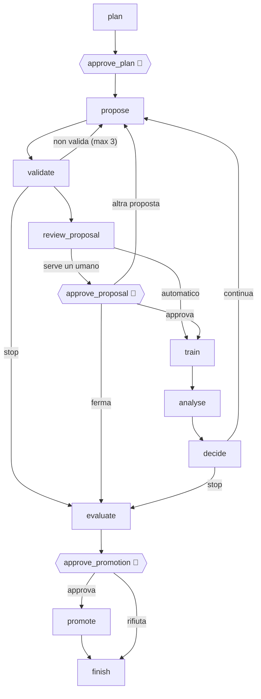

# `train_agent/`: il training agent (LangGraph)

Un agente che pianifica e adatta il training dei classificatori su DermaMNIST.
Propone cosa addestrare, lancia `train.py`, legge le curve e decide il passo
successivo. Il **controllo** resta però nel codice e nell'umano: l'LLM propone,
il codice valida, un reviewer controlla, un gate di autonomia decide se serve
un umano, e nessun modello entra nell'ensemble di previsione senza
un'approvazione esplicita.

Sostituisce l'agente a regole del progetto AgenticDerma (`derma_agent.py`:
`lr × 0.5` se il macro-F1 non migliora, `× 1.08` se migliora), con queste
differenze:

| | Agente a regole | Questo agente |
| --- | --- | --- |
| Decisioni | regole fisse sul solo lr | LLM (o politica deterministica) su architettura, iperparametri, pesi di classe, augmentation, warm restart, stop |
| Trigger | ogni epoca, sul valore di un'epoca (rumoroso) | fine segmento: plateau di `patience` epoche (l'early stop di `train.py`) o budget |
| Conoscenza | nessuna | KB di training (22 paper arXiv + note del progetto) e memoria dei run passati |
| Controllo | nessuno | validazione in codice, training reviewer, gate `guarded`, approvazioni umane |
| Modelli | un solo `model.pt`, sovrascritto | ogni run in una cartella nuova; promozione per **copia** con nome nuovo |
| Richieste | parole chiave (`"train"`, `"tuning"`…) | l'orchestratore interpreta la richiesta con un LLM, o chiede |

## Il grafo



| Nodo | Chi decide | Cosa fa |
| --- | --- | --- |
| `plan` | codice | vincoli (umano o orchestratore) + default; legge la **memoria deterministica**: run passati (`experiment_record.json` in ogni cartella di run), lezioni delle campagne precedenti (`runs_train/campaigns.jsonl`), stato dell'ensemble (classi che nessun modello riconosce bene) |
| `approve_plan` | **umano, sempre** | approva o modifica architettura, budget, autonomia, trigger, metrica |
| `propose` | **LLM** + KB | azione (`new_run` / `warm_restart` / `stop`), architettura, iperparametri, augmentation **con la sua motivazione dermoscopica**. Riceve piano, campagna finora, fatti dell'ultimo run, memoria, passaggi della KB recuperati dalla diagnosi |
| `validate` | codice (`space.py`) | limiti, lr per optimizer, `class_weight` e `balanced_sampler` alternativi, augmentation valida, warm restart sulla stessa architettura, nessuna configurazione ripetuta. Errori → torna al proposer |
| `review_proposal` | codice (`review.py`) + gate | vedi sotto |
| `approve_proposal` | **umano, se il gate lo chiede** | approva, chiede un'altra proposta (con feedback), ferma |
| `train` | codice (`runner.py`) | un segmento di `train.py`; si ferma da solo al plateau: è il **trigger** che risveglia l'agente. Le epoche escono nello stream (`custom`) |
| `analyse` | **LLM** + KB | cosa è successo, sopra i **fatti calcolati in codice** (`analysis.py`: gap train/val, plateau, overfitting, classi collassate) che l'LLM non può contraddire |
| `decide` | codice | numero di run, budget, obiettivo, errori ripetuti |
| `evaluate` | codice (`promotion.py`) | ensemble di previsione **con e senza** il candidato sulla validazione |
| `approve_promotion` | **umano, sempre** | promuovere o no |
| `promote` | codice | copia in `models_promoted/<arch>_<campagna>_<run>/` + registro |

Senza LLM (`--no-llm` o modello "nessuno"), `policy.py` fa da proposer e
analista con regole semplici: primo run con pesi `effective`; al plateau warm
restart con lr ×0.3; overfitting → weight decay ×3; classi a recall 0 → pesi
`inverse`; due segmenti senza guadagno → stop.

## Autonomia (`space.gate`)

| Livello | Cosa passa senza umano |
| --- | --- |
| `supervised` | niente: ogni run va approvato |
| `guarded` (default) | stessa architettura e solo lr (tra ×0.3 e ×3), weight decay (tra ×0.1 e ×10), epoche. Il primo run, un cambio di architettura, di pesi di classe, di sampler o di augmentation vanno all'umano |
| `autonomous` | tutto, dentro il budget |

A ogni livello:
- un rilievo `warning` o `critical` del training reviewer porta la proposta davanti all'umano;
- il **piano** e la **promozione** si approvano sempre.

## Training reviewer (`review.py`)

- la proposta dice di correggere un problema (`overfitting`, `plateau`…) che i fatti non mostrano;
- cambia più di due cose insieme (se il risultato cambia, non si saprà perché);
- augmentation più forte in underfitting; hue jitter alto sul colore, che è diagnostico;
- **la motivazione non corrisponde ai campi**. Trovato provando qwen in locale: scriveva "class_weight inverse, augmentation dihedral" nella prosa e lasciava i campi ai valori di default;
- cita passaggi della KB che non gli erano stati dati;
- ripete un cambiamento che in una campagna precedente aveva peggiorato il punteggio;
- dopo l'analisi: l'analista dice "overfitting" ma il gap non cresce (valgono i numeri).

## Augmentation

L'augmentation è parte della proposta e viene passata a `train.py` risolta campo
per campo (`--aug-config`), quindi quello che è stato validato è esattamente
quello che gira. Regole, nel prompt e nel codice:
- gruppo diedrale (flip + rotazioni di 90°) sempre ammesso, perché le lesioni non hanno un orientamento canonico;
- colore limitato (hue ≤ 0.03), perché distingue melanoma, nevi e cheratosi;
- niente bordi neri, perché imitano la vignettatura del dermatoscopio;
- cutout e crop forti solo contro un overfitting misurato;
- `augmentation_rationale` obbligatoria.

## Architetture

`fpvit` (default), `resnet18`, `efficientnet_b0`, `convnext_tiny`, tutte adattate
a 28×28 (`fpvit/cnn.py`, `fpvit/zoo.py`). Se l'umano non la fissa, la sceglie
l'agente motivandola. `train.py --arch` ha default `fpvit`, e i checkpoint
precedenti (senza `arch` nella config) restano FPViT.

## Knowledge base (`training_corpus.json`)

Ricostruibile con `python -m train_agent.build_kb`. Contiene:
- 22 abstract arXiv, ciascuno verificato per ID e titolo (un ID sbagliato viene scartato, mai incluso): DermaMNIST/HAM10000, qualità e leakage di DermaMNIST, sbilanciamento (class-balanced loss, focal loss, Buda et al.), AdamW, SGDR, CLR, Smith 2018, large-batch, bag of tricks, cutout, mixup, label smoothing, ResNet, EfficientNet, ConvNeXt, ViT, "How to train your ViT";
- 3 fonti del progetto, estratte testualmente: la motivazione delle augmentation (`fpvit/augment.py`), le note di `AUG_SEARCH_SPACE`, le note di `train.py`.

La query di retrieval nasce dalla **diagnosi** (plateau, overfitting, classi
collassate…), non da una parola chiave.

## Nessuna sovrascrittura

- ogni segmento scrive in `runs_train/<campagna>/<run>/`, e la cartella viene rifiutata se esiste;
- `--init-from` legge i pesi del run padre e scrive in una cartella nuova (`train.py` rifiuta di scrivere nella sorgente);
- `runs_train/` **non** è letta dal Testing agent: i candidati non votano;
- la promozione **copia** il checkpoint in `models_promoted/<nome nuovo>/` (rifiutata se esiste) e aggiunge una riga a `models_promoted/registry.jsonl` (sha256, valutazione, decisione umana). Il Testing agent legge `models_promoted/` e usa il modello dalla previsione successiva;
- ogni campagna salva `campaign.json` (piano, run, diagnosi, approvazioni, valutazione): il registro degli esperimenti per D3.3.

Il test split non è mai letto: la valutazione di promozione usa solo le
chiavi `val_*` del `.npz`. `evaluate_test.py` resta un passo manuale.

## Uso

```bash
python -m train_agent "migliora il riconoscimento del dermatofibroma" --minutes 30 -v
python -m train_agent --arch resnet18 --trials 3 --epochs-per-run 10 --no-llm
python -m train_agent --model ollama:qwen3.6:latest --autonomy supervised
python -m orchestrator --train "addestra una resnet per 20 minuti"   # instradato dall'orchestratore
```

Dalla piattaforma si usa il pulsante **Training**, oppure si scrive una
richiesta senza immagini: la instrada l'orchestratore.

```python
from train_agent.agent import build_trainer
from langgraph.checkpoint.memory import InMemorySaver
app = build_trainer("ollama:qwen3.6:latest", checkpointer=InMemorySaver())
out = app.invoke({"request": "...", "constraints": {"max_trials": 3, "max_minutes": 30}}, config)
# out["__interrupt__"] → Command(resume={"decision": "approve", "note": "", "edits": {...}})
```

## Verificato (2026-09-24/25)

- **Politica deterministica, ResNet-18, 3 run.** Al plateau l'agente è ripartito con lr ×0.3, approvato in automatico da `guarded`. La balanced accuracy di validazione è salita da 0.396 a 0.505, e l'ensemble da 0.501 a 0.535 con il candidato. Promozione rifiutata.
- **Dentro l'orchestratore e dalla piattaforma.** Piano modificato (budget 6 → 7 min, applicato), primo run approvato. Poi, con il dermatofibroma ancora a recall 0, l'agente ha proposto `class_weight inverse`: fuori da `guarded`, quindi è stato chiesto all'umano. Promozione +0.0109, rifiutata. Curve live per epoca.
- **qwen3.6 in locale.** Con campi facoltativi scriveva le scelte solo nella motivazione. Ora i campi decisivi sono obbligatori nello schema e la proposta porta i valori scelti (es. `class_weight: inverse`). Una campagna completa con qwen non è ancora stata eseguita fino in fondo.
- **Ensemble di previsione.** Dopo tutte le modifiche le previsioni sono identiche e gli hash dei checkpoint esistenti sono invariati.
